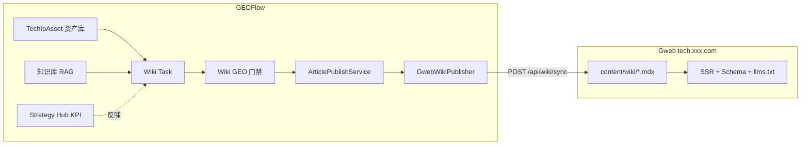

# GEOFlow 优化计划（Gweb 前台 + GEOFlow 后台）

## 定位调整



**原则**
- Wiki 对外展现：**唯一出口是 Gweb**（[`content/wiki/`](file:///Volumes/Lexar/git/08%20Gene/Gweb/content/wiki/) 已有 concepts/compare/guides/data 等 IA，frontmatter 含 `mind_tag`/`ip_layer`/`quick_answer`/`related`/`faq`）
- GEOFlow 内置 Blade 前台：保留通用 CMS 能力，**Wiki 类 Task 默认 `publish_scope=distribution_only`**（已有 [`Task.publish_scope`](file:///Volumes/Lexar/git/13%20Github/GEOFlow/app/Models/Task.php)），不在本站展示
- 不重复 Gweb 已有能力：Schema 渲染、sitemap、llms.txt 留在 Gweb

---

## 阶段零：减法与边界收敛（优先于功能扩展）

原计划在「不做 Wiki 前台」上只写了原则，**未系统梳理 GEOFlow 应减什么**。技术品牌场景下，GEOFlow 必须从「内容 CMS + 分发平台」收敛为「GEO 后台引擎」，避免与 Gweb 双轨维护。

### 0.1 能力归属：谁做什么

| 能力 | GEOFlow（减/留） | Gweb（接/做） |
|:---|:---|:---|
| Wiki 页面渲染、内链 UI | **减**：不对外 | **做** |
| JSON-LD / TechArticle / FAQPage | **减**：Wiki 不在此生成 | **做** [`schema.ts`](file:///Volumes/Lexar/git/08%20Gene/Gweb/src/lib/wiki/schema.ts) |
| sitemap / llms.txt / pages.json | **减** | **做** |
| 内容生产、RAG、审核、GEO 门禁 | **留/加强** | 不碰 |
| Strategy Hub、监控探测、采纳率 | **留/加强** | 只贡献页面清单 URL |
| 本站 PV / AI 爬虫统计 | **减权**（Wiki 场景） | **做主**（可回传 GEOFlow） |

### 0.2 三层减法（由轻到重）

**A. 立即收敛（配置 + SOP，几乎零代码）**

- Wiki 类 Task：**禁止** `local_only` / `local_and_distribution`，只允许 `distribution_only` + `gweb_wiki` 渠道
- Wiki 类 Task：**禁止**绑定 `geoflow_agent` 渠道（Agent 静态站与 Gweb 职能重叠）
- 新建 Wiki Task 向导：默认内容格式 `wiki_mdx`，隐藏「本站发布」选项
- 部署建议：生产环境 GEOFlow 公网入口仅暴露 `/geo_admin` + `/api/v1`；`/` 前台不对运营开放（或内网/demo）

**B. 停止投入（冻结，不删代码）**

以下模块**技术品牌场景不再扩展**，仅保留给开源通用 CMS 用户：

- Blade 前台主题（[`resources/views/theme/`](file:///Volumes/Lexar/git/13%20Github/GEOFlow/resources/views/theme/)）——不为 Wiki IA 新增主题页
- [`DistributionTargetSitePackageBuilder`](file:///Volumes/Lexar/git/13%20Github/GEOFlow/app/Services/GeoFlow/DistributionTargetSitePackageBuilder.php) 的 Schema/sitemap/llms 增强——Wiki 内容不走 Agent 包
- 通用 SEO 字段（`meta_description`/`keywords`）在 Wiki 模式下降为可选，**以 `wiki_meta` 为唯一真相源**
- [`guide/解析文档.md`](file:///Volumes/Lexar/git/13%20Github/GEOFlow/guide/解析文档.md) 中「站内发布是主链路」——改写为双模式：
  - **通用模式**：本站发布为主（开源默认）
  - **技术品牌模式**：Gweb 发布为主，GEOFlow 仅后台

**C. 可选下线（P2，需迁移确认后执行）**

- 若团队 exclusively 使用 Gweb：考虑 `GEOFLOW_PUBLIC_SITE_ENABLED=false` 关闭本站前台路由（保留后台）
- Analytics 中 Wiki 相关 PV 卡片改为「跳转 Gweb 分析」或接 Gweb 事件回传，避免双份指标误导决策
- 合并重复分发路径：技术 Wiki **只保留** `gweb_wiki`，逐步弃用「generic_http 推 Gweb」临时方案

### 0.3 主链路改写（架构文档减法）

当前文档描述（需改）：

```
草稿 → 审核 → 发布 → 本地前台 SEO 页面 → 分发队列
```

技术品牌模式应改为：

```
草稿 → 审核 → GEO 门禁 → distribution_only → GwebWikiPublisher → Gweb MDX → SSR/Schema
         ↑
    GEOFlow 后台（/geo_admin）全程可见；本地 articles 表仅为生产副本
```

[`ArticlePublishService`](file:///Volumes/Lexar/git/13%20Github/GEOFlow/app/Services/GeoFlow/ArticlePublishService.php) 在 `distribution_only` 下已跳过本站展示，**无需改核心逻辑**，减法主要体现在 Task 约束与 UI 引导。

### 0.4 减法验收

- [ ] Wiki Task 创建页无法选择「仅本站发布」
- [ ] Wiki Task 无法绑定 `geoflow_agent` 渠道
- [ ] 文档明确「技术品牌 = Gweb 前台 + GEOFlow 后台」双系统分工
- [ ] Strategy Hub 的 Wiki KPI 不依赖 GEOFlow 本站 PV

---

## 阶段一：技术 IP 资产域（路线图 Step 0–1）

**目标**：在 GEOFlow 管理「心智标签 → 技术 IP → Wiki 页」映射，替代纯 Obsidian 表格。

### 1.1 新增数据模型

新建 `tech_ip_assets` 表 + `TechIpAsset` 模型，字段对齐路线图资产卡：

| 字段 | 说明 |
|:---|:---|
| `ip_id`, `ip_name`, `ip_layer` | 架构层/模块层/参数层 |
| `mind_tag`, `priority` | P0/P1，关联 Step 0 |
| `can_name`, `can_visualize`, `can_translate` | 三问检验 |
| `tech_term`, `user_language` | 人话翻译 |
| `evidence` (JSON) | 白皮书/测试链接 |
| `models` (JSON) | 搭载车型 |
| `wiki_type`, `wiki_slug` | 对应 Gweb 页面类型与 slug |
| `status` | 待封装/已发布/需更新 |
| `knowledge_base_id` | 可选，关联 RAG 源 |

### 1.2 后台模块

- 路由：`/geo_admin/tech-assets`（列表 + 资产卡编辑 + 导入 YAML/CSV）
- Dashboard 摘要卡片：P0 标签覆盖率、三问全 ✅ 数量、Wiki 页缺口
- 与现有 [`KnowledgeBase`](file:///Volumes/Lexar/git/13%20Github/GEOFlow/app/Models/) 双向跳转

### 1.3 验收

- 可导入路线图附录 A 模板 ≥20 条资产
- 每条 P0 心智标签至少 1 个「三问全 ✅」IP

---

## 阶段二：Wiki 结构化文章（路线图 Step 2 生产侧）

**目标**：让 [`Article`](file:///Volumes/Lexar/git/13%20Github/GEOFlow/app/Models/Article.php) 能承载 Gweb [`WikiPageMeta`](file:///Volumes/Lexar/git/08%20Gene/Gweb/src/lib/wiki/types.ts) 全字段。

### 2.1 扩展 Article

Migration 增加：

```php
// articles 表新增
'content_format' => 'wiki_mdx' | 'article'   // 默认 article
'wiki_meta'      => JSON  // 对齐 Gweb frontmatter
'tech_ip_asset_id' => nullable FK
```

`wiki_meta` 结构（与 Gweb 一致）：

```yaml
type: concept          # concept|compare|guide|glossary|data|thread|topic
quick_answer: "..."
mind_tag: "..."
ip_layer: "模块层"
related: ["compare/lfp-vs-nmc", "data/safety-tests"]
faq: [{q, a}]
schema_type: TechArticle
last_updated: "2026-06-15"
target_query: "..."
sources: [...]
variables: [...]       # data 页专用
```

`content` 字段存 **Markdown 正文**（不含 frontmatter）；发布时由 Publisher 组装完整 MDX。

### 2.2 Wiki 专用 Prompt 模板

在 `prompts` 表 seed 四类模板（概念/对比/指南/数据），强制输出结构：

- 开头「快速结论」→ 映射 `wiki_meta.quick_answer`
- 核心信息用 Markdown 表格
- 文末 FAQ ≥2 条 → 映射 `wiki_meta.faq`
- 内链建议 → 映射 `wiki_meta.related`

Task 创建页增加 **内容格式** 与 **Wiki 页面类型** 选择；绑定 `tech_ip_asset_id` 时自动填充 `mind_tag`/`ip_layer`。

### 2.3 Content Agent 结构化输出（可选增强）

在 [`services/content-agent/config/workflows.yml`](file:///Volumes/Lexar/git/13%20Github/GEOFlow/services/content-agent/config/workflows.yml) 增加 `wiki_page` workflow：`finalize` 节点输出 `{ wiki_meta, body }` JSON，[`ContentAgentCallbackHandler`](file:///Volumes/Lexar/git/13%20Github/GEOFlow/app/Services/GeoFlow/ContentAgent/ContentAgentCallbackHandler.php) 写入 Article。

---

## 阶段三：Wiki GEO 门禁（路线图附录 B）

**目标**：发布前校验 Wiki 页是否符合 GEO 规范，复用 [`ArticleEvaluationService`](file:///Volumes/Lexar/git/13%20Github/GEOFlow/app/Services/GeoEval/ArticleEvaluationService.php)。

### 3.1 新增 `WikiGeoComplianceChecker`

路径：`app/Services/GeoEval/WikiGeoComplianceChecker.php`

检查项（对应路线图附录 B）：

| 检查 | 规则 |
|:---|:---|
| quick_answer | `wiki_meta.quick_answer` 非空，≤200 字 |
| 表格 | 正文含 `\|` 表格语法 |
| 内链 | `related` ≥3 或正文含 ≥3 个内部链接 |
| FAQ | `faq` ≥2 条 |
| last_updated | 有值 |
| schema_type | 与 type 匹配（compare→FAQPage 等，对齐 Gweb [`schema.ts`](file:///Volumes/Lexar/git/08%20Gene/Gweb/src/lib/wiki/schema.ts)） |
| 证据链 | `sources` 或 `evidence` 非空 |

### 3.2 接入评估门禁

- `content_format=wiki_mdx` 时，在现有 RAG 仿真之后追加 Wiki 合规审计
- 失败写入 `eval_meta.wiki_compliance`，后台文章详情展示检查清单
- 配置项：`config/geo_eval.php` 增加 `wiki_gate.enabled`

---

## 阶段四：Gweb 发布通道（核心集成）

**目标**：文章审核通过后，自动推送至 Gweb，触发 ISR 刷新。

### 4.1 新增分发渠道类型 `gweb_wiki`

参考现有 [`generic_http_api`](file:///Volumes/Lexar/git/13%20Github/GEOFlow/app/Services/GeoFlow/DistributionPublisherManager.php) 模式，新增 `GwebWikiPublisher`：

```
POST {gweb_base_url}/api/wiki/sync
Authorization: Bearer {GWEB_REVALIDATE_SECRET}
Body: { slug, type, frontmatter, body, action: upsert|delete }
```

Publisher 职责：
1. 将 `Article.wiki_meta` + `Article.content` 组装为 Gweb MDX
2. 按 [`WIKI_TYPE_ROUTE`](file:///Volumes/Lexar/git/08%20Gene/Gweb/src/lib/wiki/catalog.ts) 确定写入路径 `content/wiki/{routePrefix}/{slug}.mdx`
3. 成功后调用 Gweb 已有 [`POST /api/revalidate`](file:///Volumes/Lexar/git/08%20Gene/Gweb/src/app/api/revalidate/route.ts) 刷新 `/concepts/{slug}`、`/wiki`、`/sitemap` 等

### 4.2 GEOFlow 配置

[`config/geoflow.php`](file:///Volumes/Lexar/git/13%20Github/GEOFlow/config/geoflow.php) 新增：

```php
'gweb' => [
    'base_url' => env('GWEB_BASE_URL'),
    'sync_secret' => env('GWEB_REVALIDATE_SECRET'),
    'sync_enabled' => env('GWEB_SYNC_ENABLED', false),
],
```

### 4.3 发布流程调整

Wiki Task 推荐配置：

- `publish_scope = distribution_only`（本地仅作草稿管理）
- 绑定 `gweb_wiki` 分发渠道
- `ArticlePublishService` 发布成功后 → `DistributionOrchestrator` → `GwebWikiPublisher`

### 4.4 Gweb 侧依赖（跨仓库，GEOFlow 计划前置条件）

Gweb 需新增 `POST /api/wiki/sync`（写 MDX + 日志），GEOFlow 本阶段只定义契约与 Publisher；可先用 `generic_http_api` 临时对接。

---

## 阶段五：Strategy Hub 增强（路线图 Step 5）

**目标**：在 [`/geo_admin/strategy`](file:///Volumes/Lexar/git/13%20Github/GEOFlow/docs/l1-strategy-hub.md) 增加「技术品牌」视图。

### 5.1 新增 KPI 区块

| 指标 | 数据源 |
|:---|:---|
| Wiki 页合规率 | `articles` where `content_format=wiki_mdx` + eval_meta |
| P0 心智标签覆盖率 | `tech_ip_assets` |
| AI 引用/采纳率 | 现有 `geo_monitor_*` |
| Gweb 同步成功率 | `article_distributions` where channel=gweb_wiki |

### 5.2 闭环动作

- 监控问题库命中 → 关联 TechIpAsset → 一键创建 Wiki Task
- 采纳率下降 → 标记资产 `status=需更新` → 触发重新生成

---

## 阶段六：文档与边界声明

更新 [`guide/解析文档.md`](file:///Volumes/Lexar/git/13%20Github/GEOFlow/guide/解析文档.md) 与新建 `guide/gweb-integration.md`：

- 明确 GEOFlow = 生产/评估/策略后台
- Wiki 前台 SSOT = Gweb
- Wiki 同步 API 契约、环境变量、Task 配置 SOP
- 路线图 Step 0–5 与 GEOFlow/Gweb 模块映射表

---

## 不在 GEOFlow 范围内

| 能力 | 归属 |
|:---|:---|
| Wiki 页面渲染、Schema 注入、llms.txt | Gweb |
| Step 0 竞品心智地图 UI | Obsidian + 人工评审（资产库可导入） |
| Step 3 官网/社媒内链矩阵 | 官网 CMS + 运营 SOP |
| Step 5 舆情/销售 KPI | 外部系统 API 对接 |

---

## 实施优先级与时间估算

| 优先级 | 阶段 | 工作量 | 依赖 |
|:---:|:---|:---:|:---|
| **P0** | **阶段零 减法收敛** | **1–2 天** | **无（应最先做）** |
| P0 | 阶段一 IP 资产库 | 3–4 天 | 阶段零 |
| P0 | 阶段二 Wiki 元数据 + Prompt | 3–4 天 | 阶段一 |
| P0 | 阶段四 Gweb 发布通道 | 4–5 天 | Gweb `/api/wiki/sync` |
| P1 | 阶段三 Wiki GEO 门禁 | 2–3 天 | 阶段二 |
| P1 | 阶段五 Strategy Hub | 3–4 天 | 阶段一、四 |
| P2 | 阶段六 文档 | 1 天 | 各阶段 |
| P2 | Content Agent wiki workflow | 3 天 | 阶段二 |

**建议迭代顺序**：**零（减法）** → 一 → 二 → 四（先打通端到端）→ 三 → 五 → 六

---

## 端到端验收（DoD）

1. 在 GEOFlow 创建「神盾电池」TechIpAsset（P0，三问全 ✅）
2. 创建 Wiki Task（concept 类型，`distribution_only` + gweb 渠道）
3. AI 生成 → Wiki GEO 门禁通过 → 审核通过 → 自动发布
4. Gweb `/concepts/shen-dun-battery` 可访问，frontmatter 与路线图模板一致
5. Strategy Hub 显示该 IP「已发布」及合规率 100%
