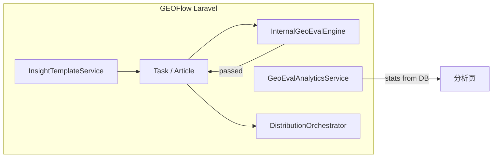

# GEO 策略架构（GEOFlow 独立版）

## 原则

- **不调用 GEO-OS API**；GEO-OS 仓库仅作设计与算法参考。
- **单一运行时**：Laravel + PostgreSQL + Redis + 现有 AiModel / 知识库 / 分发。
- **同一套后台**：顶栏「GEO 评估」、分析页、洞察模板、任务门禁。

## 与 GEO-OS 概念映射



| GEO-OS 模块 | 职责 | GEOFlow 落点 |
|-------------|------|--------------|
| `simulation/*` | RAG 沙盒、排名、审计 | `InternalGeoEvalEngine` → 后续 `SimulationService` |
| `insight/strategy_miner` | URL → StyleGuide | `InsightTemplateService` |
| `strategy/*` | 采纳率、趋势 | `GeoEvalAnalyticsService` + `geo_strategy_metric_snapshots` |
| `market_monitor/*` | 竞品/采纳扫描 | `GeoMarketScanCommand`（采纳指标周快照，非竞品爬虫） |
| `lib/api_response` | 统一信封 | `GeoEvalEnvelope`（内部数组，无 HTTP） |

## 目录约定（建议保持）

```
app/Services/GeoEval/
  Contracts/GeoEvalClientInterface.php   # 内置引擎端口
  InternalGeoEvalEngine.php              # RAG 仿真 + 规则审计（LLM 答案可选 mock）
  ArticleEvaluationService.php         # 门禁与状态机
  InsightTemplateService.php
  GeoEvalStructuredLogger.php
```

## 配置

`config/geo_eval.php` — 仅 `enabled`、`gate_*`、`simulation.*`、`brand_keywords`，无外部 `base_url`。

## 禁止项

- 不在 compose 中为 GEO-OS 增加 `host.docker.internal:8000` 硬依赖。
- 不在 `AppServiceProvider` 注册 HTTP 出站客户端（已移除 `GeoEvalHttpClient`）。
