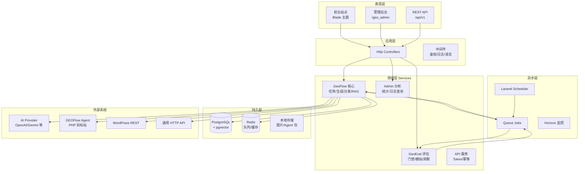
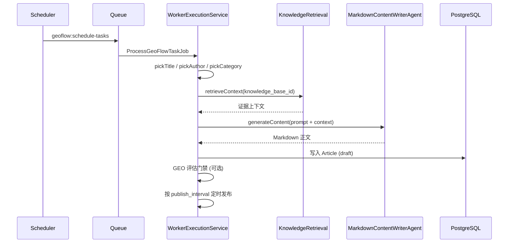
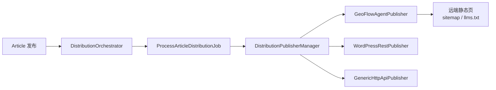
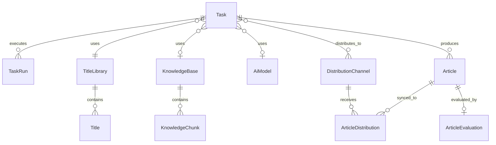

# GEOFlow 系统架构说明

GEOFlow 是一套面向 **GEO（生成式引擎优化）** 的开源 **智能内容工程 + 多站点分发** 平台。核心目标：把可信知识库沉淀为可管理、可发布、可追踪、可同步到多端的内容资产。

**技术品牌模式**（`GEOFLOW_TECH_BRAND_MODE=true`）：GEOFlow 作为 GEO 后台引擎，Wiki 对外展现由 **GEOweb** 承接；详见 [geoweb-integration.md](./geoweb-integration.md)。旧 Gweb 仓库不再承接 Wiki 分发。

---

## 1. 总体定位

系统把以下能力串成一条可持续运营链路：

**通用模式（开源默认）**

```
知识库 / 素材库 / 提示词
        ↓
AI 任务调度 → 队列生成正文
        ↓
草稿 → 审核 → 发布
        ↓
本地前台 SEO 页面
        ↓
分发队列 → 远端站点（Agent / WordPress / HTTP API）
        ↓
数据分析（PV、爬虫、分发状态、GEO 评估）
```

**技术品牌模式（GEOweb 前台）**

```
技术 IP 资产 → Wiki Task → GEO 门禁 → 审核
        ↓
distribution_only → GeowebPublisher → GEOweb Markdown
        ↓
Strategy Hub KPI（不含本站 Wiki PV）
```

**设计原则：**
- **站内发布是主链路**（通用模式），外部分发独立队列
- **技术品牌模式**：GEOweb 为 Wiki 唯一对外出口，Wiki Task 禁止本站发布
- **业务运行时单一**：Laravel + PostgreSQL + Redis 为业务真相源；Content Agent Python 侧车为**可选** AI 编排扩展（`GEOFLOW_CONTENT_AGENT_BACKEND=external` 时启用）
- **Agent-First**：任务 → 生成 → 评估 → 分发，全程可观测、可重试

---

## 2. 技术栈

| 层级 | 技术 |
|------|------|
| 应用框架 | **Laravel 12**（PHP 8.2+） |
| AI 调用 | **Laravel AI SDK**（`laravel/ai`），兼容 OpenAI 风格 + Gemini 原生 |
| 队列 | **Redis** + `queue:work` / **Horizon** |
| 实时 | **Laravel Reverb**（WebSocket，任务状态广播） |
| 数据库 | **PostgreSQL 16 + pgvector**（向量召回） |
| 认证 | 后台 Session；API 用 **Sanctum Token + Scope** |
| 前端 | **Blade** 后台 + 可切换主题的前台站点 |
| 部署 | Docker Compose（开发/生产 Nginx + php-fpm） |

---

## 3. 分层架构



---

## 4. 部署架构

### 开发环境（`docker-compose.yml`）

| 服务 | 职责 |
|------|------|
| `postgres` | PostgreSQL + pgvector |
| `redis` | 队列、缓存 |
| `init` | 一次性迁移 + seed |
| `app` | `php artisan serve` |
| `queue` | `queue:work redis`（队列 `geoflow,distribution,default`） |
| `scheduler` | `schedule:work`（每分钟扫描任务） |
| `reverb` | WebSocket |
| `content-agent` | 可选 Python 侧车：异步 AI workflow（LangGraph 默认，可换 LangChain） |

### 生产环境（`docker-compose.prod.yml`）

- **Nginx** 反向代理 + **php-fpm** 解析 PHP
- 站点根目录指向 `public/`
- 后台路径由 `ADMIN_BASE_PATH` 控制（默认 `geo_admin`）

---

## 5. 核心业务域

### 5.1 素材与知识库（输入层）

| 模块 | 模型/表 | 作用 |
|------|---------|------|
| 知识库 | `KnowledgeBase` / `KnowledgeChunk` | 文档上传、结构化/语义切片、向量化 |
| 标题库 | `TitleLibrary` / `Title` | 任务选题来源 |
| 关键词库 | `KeywordLibrary` / `Keyword` | SEO 与标题 AI 生成 |
| 图片库 | `ImageLibrary` / `Image` | 正文插图 |
| 作者库 | `Author` | 文章署名 |
| 提示词 | `Prompt` | 正文/特殊提示词模板 |

**RAG 召回**（`KnowledgeRetrievalService`）：
- pgvector 向量相似度 + 关键词/标题/元数据混合打分
- 生成时注入 `KnowledgeRetrievalService::retrieveContext()` 作为证据上下文

### 5.2 AI 配置与生成

| 组件 | 说明 |
|------|------|
| `AiModel` | chat / embedding 模型配置，API Key 加密存储 |
| `MarkdownContentWriterAgent` | Laravel AI Agent，负责正文生成（超时 240s） |
| `OpenAiRuntimeProvider` | OpenAI 兼容 + Gemini 原生路径适配 |
| `WorkerExecutionService` | **核心执行器**：选题 → RAG → 生成 → 插图 → 写库 |

#### Content Agent 可插拔架构

Laravel 业务层通过 **`ContentAgentClientInterface`** 调用 AI 编排，**不出现** LangGraph/LangChain 类名：

| 配置 | 行为 |
|------|------|
| `GEOFLOW_CONTENT_AGENT_BACKEND=internal` | Laravel AI SDK 同步生成（默认，零 Python） |
| `GEOFLOW_CONTENT_AGENT_BACKEND=external` | HTTP 提交 Python 侧车，HMAC 回调落库 |

- **端口**：`ContentAgentClientInterface` → `InternalContentAgent` / `ExternalContentAgentClient`
- **追踪表**：`content_agent_requests`（workflow：`content` / `url_import` / `semantic_chunk`）
- **回调**：`POST /internal/content-agent/callback`（签名字段 `X-Content-Agent-*`）
- **Python 引擎**：`CONTENT_AGENT_DRIVER=langgraph|langchain`（仅侧车 env，换引擎不改 Laravel）
- **LangGraph 编排**：`services/content-agent/config/agents.yml`（Agent 人设）+ `workflows.yml`（节点拓扑）；详见 `guide/langgraph-orchestration.md`
- **RAG 写入**：Embedding 与 chunk 落库仍在 Laravel（`KnowledgeChunkSyncService`）

生成流程概要：



### 5.3 任务调度（Task 域）

| 概念 | 说明 |
|------|------|
| `Task` | 任务配置：素材、模型、发布频率、审核开关、发布范围 |
| `TaskRun` | 单次执行记录（成功/失败/重试） |
| `TaskSchedule` | 调度元数据 |
| `publish_scope` | `local_and_distribution` / `local_only` / `distribution_only` |

**调度链路：**
1. `Schedule::command('geoflow:schedule-tasks')->everyMinute()`
2. 扫描 `next_run_at` 到期的 active 任务
3. 创建 `TaskRun`，dispatch `ProcessGeoFlowTaskJob` 到 `geoflow` 队列
4. Worker 执行生成或发布到期草稿

### 5.4 文章生命周期

| 状态 | 字段 |
|------|------|
| 内容状态 | `status`: draft / published / private |
| 审核状态 | `review_status`: pending / approved / rejected / auto_approved |
| GEO 评估 | `eval_status`: pending_eval / passed / failed / skipped |

`ArticleWorkflow` 统一状态机转换；审核通过后按任务配置自动或手动发布。

### 5.5 多站点分发（Distribution 域）

**架构模式：发布成功后异步分发，与站内状态解耦。**



| 表/模型 | 作用 |
|---------|------|
| `DistributionChannel` | 渠道配置（类型、URL、模式） |
| `DistributionChannelSecret` | 加密凭据 |
| `task_distribution_channels` | 任务 ↔ 渠道多对多 |
| `ArticleDistribution` | 单篇文章在某渠道的同步状态 |
| `DistributionLog` | 分发日志 |

**三种渠道类型：**
- **`geoflow_agent`**：预配置 PHP Agent 包，生成静态首页/详情页、sitemap、TXT 地图、`llms.txt`
- **`wordpress_rest`**：WordPress REST API 发布
- **`generic_http_api`**：通用 HTTP 回调

`DistributionOrchestrator::enqueueForArticle()` 在文章发布后构建 payload，写入 `ArticleDistribution`，dispatch 到 `distribution` 队列。

### 5.6 GEO 评估（GeoEval 域）

内置引擎，**不调用外部 GEO-OS API**（见 `docs/geo-strategy-architecture.md`）。

| 服务 | 职责 |
|------|------|
| `InternalGeoEvalEngine` | 模拟 RAG、排名、审计 |
| `ArticleEvaluationService` | 文章门禁、状态机、队列评估 |
| `InsightTemplateService` | URL → StyleGuide，注入生成 prompt |
| `GeoEvalAnalyticsService` | 采纳率、趋势统计 |
| `SimulationRagService` / `AnswerAuditService` | 沙盒模拟与答案审计 |

评估可在生成后作为门禁（`gate_rollout_percent` 控制灰度），通过后继续发布/分发。

### 5.7 数据分析

- 路由：`/admin/analytics`
- 服务：`AnalyticsOverviewService`、`AnalyticsLogQueryService`、`GeoEvalAnalyticsService`
- 数据源：`view_logs`（前台 PV）、`DistributionLog`、`TaskRun`、`geo_eval_event_logs` 等
- `TrafficClassifier` 识别 AI 爬虫 vs 普通访问

---

## 6. 接口与入口

### 6.1 Web 路由（`routes/web.php`）

| 前缀 | 用途 |
|------|------|
| `/` | 前台：首页、分类、文章、归档 |
| `/geo_admin` | 后台：仪表盘、任务、素材、分发、分析、GEO 评估诊断 |

### 6.2 REST API（`routes/api.php`，前缀 `/api/v1`）

| Scope | 能力 |
|-------|------|
| `catalog:read` | 模型、提示词、库、作者、分类元数据 |
| `tasks:*` | 任务 CRUD、启停、入队 |
| `materials:*` | 素材库 CRUD |
| `articles:*` | 文章 CRUD、审核、发布 |
| `jobs:read` | 任务执行记录 |

认证：`Authorization: Bearer` + Sanctum Token；写操作支持幂等（`ApiIdempotencyKey`）。

---

## 7. 目录结构（核心）

```
app/
├── Ai/Agents/              # Laravel AI Agent（正文生成）
├── Console/Commands/       # geoflow:schedule-tasks 等
├── Http/
│   ├── Controllers/
│   │   ├── Admin/        # 后台控制器
│   │   ├── Api/V1/       # REST API
│   │   └── Site/         # 前台
│   └── Middleware/       # 鉴权、日志、语言
├── Jobs/
│   ├── ProcessGeoFlowTaskJob      # 任务生成
│   ├── ProcessArticleDistributionJob  # 分发
│   └── EvaluateArticleJob         # GEO 评估
├── Models/                 # Eloquent 模型
├── Services/
│   ├── GeoFlow/            # 核心业务（生成、RAG、分发）
│   ├── GeoEval/            # GEO 评估与模拟
│   ├── Admin/Analytics/    # 数据分析
│   └── Api/                # API Token、幂等
└── Support/                # 工具类、工作流、主题目录

config/
├── geoflow.php             # 站点、后台路径、上传、代理
├── geo_eval.php            # GEO 评估开关与门禁
├── horizon.php             # 队列监控
└── queue.php               # Redis 队列

routes/
├── web.php
├── api.php
└── console.php             # Scheduler 定义

docs/                       # 设计文档、部署说明
scripts/                    # start.sh / stop.sh / verify.sh
```

---

## 8. 数据模型关系（简化）



---

## 9. 队列与定时任务

| 队列名 | Job | 用途 |
|--------|-----|------|
| `geoflow` | `ProcessGeoFlowTaskJob` | AI 生成、定时发布 |
| `distribution` | `ProcessArticleDistributionJob` | 多站点同步 |
| `default` | `EvaluateArticleJob` | GEO 评估 |

| 定时命令 | 频率 |
|----------|------|
| `geoflow:schedule-tasks` | 每分钟 |
| `horizon:snapshot` | 每 5 分钟 |
| `geo:aggregate-adoption-metrics` | 每天 02:00 |
| `geo:market-scan` | 每周一 03:00 |
| `geo:check-adoption-alerts` | 每天 08:30 |

---

## 10. 安全与可观测

- **API Key**：`enc:v1` 加密，根密钥来自 `APP_KEY`
- **后台登录**：连续失败 5 次锁定（`geoflow:admin-unlock` 解锁）
- **API**：Scope 细粒度授权 + 登录限速
- **URL 导入**：SSRF 防护（`url_import_allow_mixed_dns` 默认关闭）
- **出站代理**：AI Provider 可走代理，分发渠道默认直连
- **日志**：`GeoEvalStructuredLogger`、`DistributionLog`、`AdminActivityLog`、`SystemLog`

---

## 11. 扩展点

| 扩展 | 方式 |
|------|------|
| 新 AI Provider | `AiModel` 配置 + `OpenAiRuntimeProvider` 适配 |
| 新分发渠道 | 实现 `DistributionPublisherInterface`，注册到 `DistributionPublisherManager` |
| 前台主题 | `SiteThemeCatalog` + `resources/views/themes/` |
| GEO 评估策略 | 扩展 `InternalGeoEvalEngine` / `SimulationService` |
| 自动化集成 | REST API + Token Scope，或 Webhook 式 `generic_http_api` |

---

## 12. 总结

GEOFlow 采用 **经典 Laravel 分层 + 双队列异步** 架构：

1. **配置层**：模型、素材、提示词、渠道在后台集中管理  
2. **生产层**：Scheduler → Task → Worker → AI + RAG → Article  
3. **质量层**：审核 + 可选 GEO 评估门禁  
4. **发布层**：本地前台 SEO + 独立分发队列  
5. **运营层**：Analytics 与 Horizon 监控  

整体以 **PostgreSQL 为单一事实来源**，Redis 承担队列与缓存，外部分发与 AI 调用均异步化，保证主链路稳定、故障可隔离、过程可追踪。