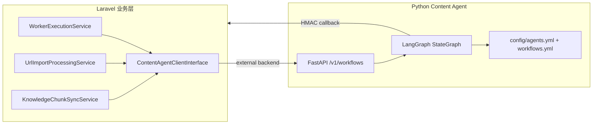
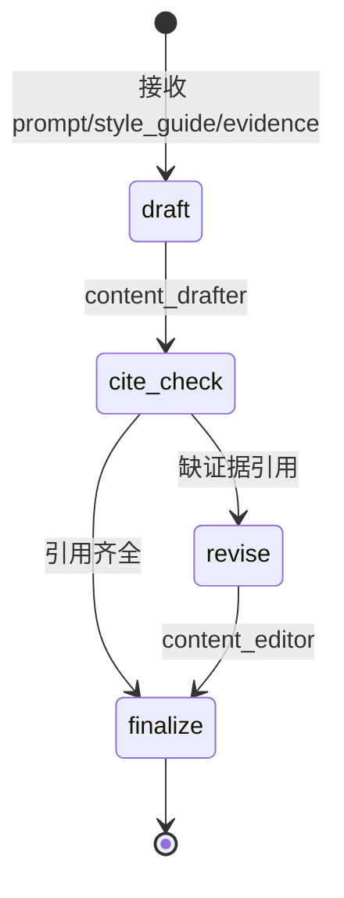
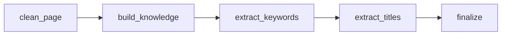
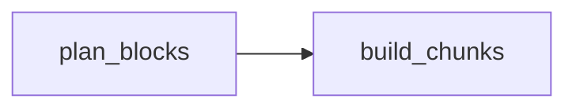

# LangGraph 编排设计与 Agent 配置

> Content Agent 侧车（`services/content-agent`）的 workflow 编排规范。Laravel 业务层只认 `ContentAgentClientInterface` 契约，不出现 LangGraph 类名。
>
> **v3 主路径**：内嵌 `run_workflow_sync`（见 `geoflow-v3/backend/app/ai/workflow_runner.py`）。  
> **外挂**：`content-LangGraph-CLI` 仅作离线 `--demo` 试跑与 YAML 契约门禁，不替换生产引擎。详见 [cli-plugins.md](./cli-plugins.md)。
---

## 1. 架构定位



| 层级 | 职责 | 不出现 |
|------|------|--------|
| Laravel | 提交 payload、追踪 `content_agent_requests`、回调落库 | LangGraph / LangChain |
| Python 侧车 | 读取 YAML 配置、编译 StateGraph、执行 Agent 节点 | 业务表结构 |
| YAML 配置 | Agent 人设、节点拓扑、条件边 | 运行时密钥 |

---

## 2. Workflow 一览

| workflow_type | 触发方 | 图结构 | 输出 |
|---------------|--------|--------|------|
| `content` | 任务正文生成（external） | draft → cite_check → [revise] → finalize | Markdown + citations |
| `url_import` | URL 导入分析 | clean → knowledge → keywords → titles | 知识库/词库预览 |
| `semantic_chunk` | 知识库语义切片 | plan → build_chunks | chunk 列表 |

### 2.1 content 正文生成



**状态字段**（`ContentState`）：

- 输入：`prompt`、`style_guide`、`evidence`、`model`
- 中间：`content`、`needs_revision`
- 输出：`citations`、`trace`

### 2.2 url_import 页面导入



四步均为 LLM Agent，上一步 JSON 输出作为下一步输入。

### 2.3 semantic_chunk 语义切片



`plan_blocks` 由 LLM 规划 block 边界；`build_chunks` 为规则节点，不调用模型。

---

## 3. Agent 配置（agents.yml）

路径：`services/content-agent/config/agents.yml`

```yaml
agents:
  content_drafter:
    name: 正文起草
    system_prompt: |
      你是专业中文写作助手...
    temperature: 0.7
    output_format: markdown
```

| 字段 | 说明 |
|------|------|
| `name` | 可读名称，写入 trace |
| `system_prompt` | Agent 系统指令 |
| `temperature` | 覆盖 defaults |
| `output_format` | `markdown` / `json` |
| `user_template` | 可选 Jinja 风格占位（`{prompt}`、`{context}`） |

**defaults** 段统一兜底：`temperature`、`timeout_seconds`、`mock_on_missing_credentials`。

---

## 4. Workflow 拓扑（workflows.yml）

路径：`services/content-agent/config/workflows.yml`

```yaml
workflows:
  content:
    nodes:
      - id: draft
        type: agent
        agent: content_drafter
      - id: cite_check
        type: rule
        handler: cite_check
    edges:
      - from: __start__
        to: draft
      - from: cite_check
        to: revise
        when: needs_revision
```

| 节点类型 | 说明 |
|----------|------|
| `agent` | 调用 `agents.yml` 中定义的 LLM Agent |
| `rule` | 纯 Python 规则（校验、组装、无模型） |

| 边类型 | 说明 |
|--------|------|
| 普通边 | 无条件流转 |
| `when: needs_revision` | 条件边，读取 state 布尔字段 |

---

## 5. 运行时切换

| 环境变量 | 默认值 | 说明 |
|----------|--------|------|
| `CONTENT_AGENT_DRIVER` | `langgraph` | `langgraph` / `langchain`（当前同实现） |
| `GEOFLOW_CONTENT_AGENT_BACKEND` | `internal` | Laravel 侧：进程内 / 外部侧车 |
| `CONTENT_AGENT_CONFIG_DIR` | `config` | YAML 配置目录 |
| `OPENAI_BASE_URL` / `OPENAI_API_KEY` | — | 侧车默认模型端点（payload.model 优先） |

**降级策略**：

1. 未安装 `langgraph` 包 → 按 `workflows.yml` 边序线性执行（行为与图等价）
2. 无 API Key → `mock_on_missing_credentials=true` 时返回占位草稿，便于联调

---

## 6. 回调契约

侧车完成后 `POST /internal/content-agent/callback`：

```json
{
  "contract_version": "1.0",
  "request_id": "uuid",
  "workflow_type": "content",
  "status": "success",
  "engine": "langgraph",
  "result": { "content": "...", "citations": [], "trace": {} },
  "error": null
}
```

签名字段：`X-Content-Agent-Timestamp`、`X-Content-Agent-Nonce`、`X-Content-Agent-Signature`。

Laravel 追踪表：`content_agent_requests`（`workflow_type` + `status` + `engine`）。

---

## 7. 扩展新 Workflow 的步骤

1. 在 `agents.yml` 增加 Agent 定义
2. 在 `workflows.yml` 声明节点与边
3. 在 `app/workflows/nodes/` 实现 rule handler（若有）
4. 在 `app/orchestration/graph_runner.py` 注册 state 类型（若与现有不同）
5. `main.py` 的 `workflow_type` 白名单增加新类型
6. Laravel `ContentAgentClientInterface` 增加 dispatch 方法 + 回调 handler

---

## 8. 与 L2 / L3 的关系

- **L2 知识库**：`semantic_chunk` workflow 为 RAG 切片规划；Embedding 落库仍在 Laravel
- **L3 任务生成**：`content` workflow 对应 `WorkerExecutionService` 正文阶段；RAG 召回在 Laravel 完成，证据通过 payload 传入
- **L1 洞察**：`style_guide` 由 `InsightTemplate` 在 Laravel 侧组装后写入 payload

### 8.1 Production Hub 可观测性

L2 页面 `/geo_admin/production` **不执行** LangGraph，但展示编排状态：

- `ContentAgentOrchestrationStatsService` 聚合 `content_agent_requests`
- Overview Tab：侧车健康、24h 工作流统计、backend 模式
- Knowledge Tab：进行中的 `semantic_chunk` 请求、最近失败

Docker 启用 external 见 [content-agent-deploy.md](./content-agent-deploy.md)。

---

## 9. Chief-Deputy 编辑部 Pipeline（`content_pipeline`）

任务级开关 `tasks.content_pipeline_mode`：

| 值 | 行为 |
|----|------|
| `legacy`（默认） | 现有 `content` workflow |
| `pipeline` | 强制 `content_pipeline`（需 external） |
| `auto` | external 时走 `content_pipeline` |

### 9.1 编排拓扑

`Chief` → `Deputy 路由` →（`fast` 直写 / `deep` 并行检索合并）→ `Writer` → 交叉验证 → `Editor` → 交叉验证 → `Brand/Compliance` → `Deputy 终审`。

- **Researcher / Brand 检索**：Laravel `ContentPipelineContextService` 调用 `KnowledgeRetrievalService`，双 query 写入 `research_pack` / `brand_pack`
- **记忆**：`content_agent_memories` 表；Chief 输出 `memory_patch`，回调后 `ContentAgentMemoryService` 更新
- **Publisher**：不在侧车；回调后 `ContentPipelinePublishBridge` 在 `review_status ∈ {approved, auto_approved}` 且 `schedule_enabled=1` 时调用 `ArticlePublishService::publishDueDraftForTask`

### 9.2 配置入口

- 任务表单：内容编排模式
- 观测：`/geo_admin/production` 编排面板含 `content_pipeline` 统计
- 修改编排：`services/content-agent/config/workflows.yml` + `agents.yml`，重启 `content-agent`
- **Agent 人设 UI**：`/production/ai-agents`（读/写 `geoflow-v3/backend/app/ai/config/agents.yml`，保存后热清缓存）

---

*相关：`guide/解析文档.md` §5.2、`config/geoflow.php` content_agent、`services/content-agent/config/`。*
