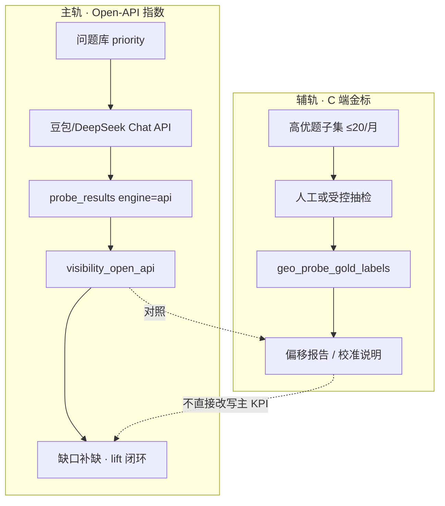

# 专题：探针真值标定（Probe Truth Calibration）

> **专题代号：** `PROBE-TRUTH`  
> **创建：** 2026-07-14  
> **状态：** 立项 / 待排期  
> **前置：** [真实闭环 P0](./真实闭环P0.md)（Open-API 闭环已通）  
> **关联：** [探针设计](./探针设计.md) · Wave W8-6+ daily_limit

---

## 1. 一句话定义

在 **无法等价复现国内 AI 助手 C 端联网回答** 的约束下，建立一套 **双轨可见性度量体系**：  
主轨用可工程化的 Open-API 指数驱动闭环；辅轨用小样本金标标定偏移，并逐步收紧 Rank / Citation 解析与成本护栏。

---

## 2. 背景与动机

P0 已堵住「corpus 静默污染」并打通缺口 → Task → lift。若继续把 Chat Completions 回答直接等同于「用户在豆包/元宝里看到的推荐」，会产生 **系统性假闭环**。

本专题专门治理下列四挑战（不可合并糊弄）：

| # | 挑战 | 后果 |
|---|------|------|
| C1 | **语义偏差**：Chat 回答 ≠ 带检索/插件的 C 端回答 | 可见性 KPI 系统性偏移，lift 方向可能反了 |
| C2 | **无稳定 Search/Citation API** | 无法官方拿到「本次引用了哪些 URL」 |
| C3 | **成本与限流**：6 平台 × 50+ 题/日撞墙 | 扫描失败/降级/账单失控 |
| C4 | **解析脆弱**：按文本首次出现估 rank | 榜单/对比型回答误判位次 |

---

## 3. 目标与非目标

### 3.1 目标（DoD 级）

1. **口径分离**：后台/报告显式区分 `visibility_open_api` 与 `visibility_cend_sample`，禁止混报。
2. **偏移可测**：每月至少 1 轮「同题 × 同平台」Open-API vs 人工/抽检 C 端对照，输出偏移系数与置信区间说明。
3. **Citation 降级策略落地**：无官方引用时，采用「答文 URL 抽取 + Wiki 域名匹配 + 人工抽检」三层，且 UI/报告标注证据等级。
4. **成本护栏**：`priority` 批次 + `ai_models.daily_limit`（W8-6+）生效；超限可观测、可排队、不可静默假数据。
5. **Rank 解析 v2**：对「列表/TOP N/对比」回答用结构化抽取（编号列表优先于首次出现），并附解析置信度字段。

### 3.2 非目标（明确不做）

- 不承诺「100% 复现豆包 App 联网回答」。
- 不建设全量 6 平台 × 450 题/日的真人抽检工厂（只做金标小样本）。
- 不把浏览器自动化爬 C 端作为默认主链路（仅允许研发/抽检沙箱，且合规评审后另题）。

---

## 4. 总体架构：双轨度量



**原则**：主轨驱动行动；辅轨校准信任。金标 **不** 自动覆盖 Open-API KPI，只在报告增加「可信度脚注」。

---

## 5. 课题分解（Workstream）

### WS-A · 语义偏差与口径（对应 C1）

| 项 | 内容 |
|----|------|
| 产出 | `metric_kind` 枚举：`open_api` / `cend_sample` / `corpus` / `llm_sim`；报告封面强制展示主轨口径 |
| 工程 | 扫描结果与 remediation lift 默认只认 `engine=api`（已有 strict_api 基础） |
| 方法 | 金标题集：每场景 1–2 题，覆盖 brand/product/competitor；记录「是否联网/是否显示引用」 |
| 验收 | 任一报告页删除口径标签后无法解读 = 不合格 |

### WS-B · Citation 证据链（对应 C2）

| 证据等级 | 定义 | 用法 |
|----------|------|------|
| L0 | 无 URL、仅提及品牌 | 计入 mention，不计 citation |
| L1 | 答文抽 URL 且域名匹配 Wiki/官网 | 弱证据，可进 citation_chain |
| L2 | 平台显式引用块（若未来有 API）或人工确认截图 | 强证据 |
| L3 | 官方 Search/Citation API | 目标态，暂不可得 |

工程项：API 路径解析答文 URL → `geo_monitor_probe_citations` 增加 `evidence_level`；禁止把 corpus 相关文当作 L1。

### WS-C · 成本与限流（对应 C3 / W8-6+）

| 策略 | 说明 |
|------|------|
| Priority 批次 | daily：priority≥80；weekly market：全量或 ≥50 |
| Platform 子集 | 生产默认仅豆包+DeepSeek；其余平台周抽或跳过 |
| daily_limit | 按 `ai_models.daily_limit` 截断；写 `engine=skipped` + 告警，不降级污染 |
| 预算看板 | 日探针次数、token/费用估算、skipped 占比 |

验收：故意打满 limit 时，KPI 中 `skipped` 可见，且 visibility 分母策略文档化（建议分母排除 skipped）。

### WS-D · Rank 解析加固（对应 C4）

当前：全文首次出现品牌 ≈ rank=1。  

目标解析管线：

1. 识别列表结构（`1.` / `一、` / markdown 有序表）
2. 按列表序赋 rank；无列表再退回首次出现
3. 输出 `rank_method`：`list_order` | `first_mention` | `unknown`
4. `ranking_score` 仅在 `list_order` 或人工复核时参与高权重报表

验收：准备 20 条榜单型金样答文，list_order 准确率 ≥80%。

---

## 6. 数据模型草案（后续 migration）

```
geo_probe_gold_labels
  id, question_id, platform, captured_at
  source          -- manual | browser_sandbox
  mentioned, brand_rank, snippet, cited_urls JSON
  open_api_probe_id   -- 同题同日对照
  notes

geo_monitor_probe_results 扩展（建议）
  rank_method       -- list_order | first_mention | unknown
  evidence_level    -- L0..L3（或挂 citations 表）

geo_monitor_probe_citations 扩展
  evidence_level, match_type  -- domain_wiki | domain_official | none
```

---

## 7. 里程碑建议

| 阶段 | 周期 | 交付 |
|------|------|------|
| **M0 口径闸门** | 3–5 天 | 报告/Overview 强制 metric_kind；文档与 UI 文案 |
| **M1 限流护栏** | 3–5 天 | daily_limit + priority 批次 + skipped 可观测（合入 W8-6+） |
| **M2 Rank v2** | 5–7 天 | list_order 解析 + rank_method + 金样评测脚本 |
| **M3 Citation L1** | 5–7 天 | API 答文 URL 抽取 + evidence_level + 禁止假 citation |
| **M4 金标对照** | 持续 / 首月 1 周 | 金标表 + 月度偏移报告模板（可人工采集起步） |

依赖：P0 迁移 012、strict_api 已开；M1 不依赖真人抽检即可上线。

---

## 8. 成功指标（专题 KPI）

| 指标 | 目标（首季） |
|------|-------------|
| 报告口径误读投诉 / 混报 | = 0 |
| API 扫描中 skipped 可解释率 | 100%（有告警或原因码） |
| Rank 金样 list_order 准确率 | ≥ 80% |
| 假 citation（corpus 冒充引用） | = 0 |
| 月度 Open-API vs 金标偏移报告 | ≥ 1 份/月 |

---

## 9. 风险与决策

| 风险 | 决策倾向 |
|------|----------|
| 业务方要求「跟加我推荐官一样准」 | 明确：我们做 **可复现工程指数 + 抽检校准**，不是黑箱全量 C 端仿真 |
| 想上 Playwright 爬登录态助手 | 单独立项做合规评审，**不**默认进 Celery 主链路 |
| 成本压力 | 宁减平台/题量，不开放静默 corpus 填洞 |

---

## 10. 与现网的切分

| 层 | 现网（P0） | 本专题 |
|----|-----------|--------|
| 能不能闭环行动 | ✅ Open-API lift | 校准信任、降低误导 |
| 算不算「真·用户看到的可见性」 | ❌ 未声称 | 辅轨金标逼近 |
| Citation | corpus 已隔离 | API 答文 L1 + 等级 |
| 成本 | 限扫题数 | daily_limit + 批次策略硬化 |

---

## 11. 入口与负责人（待填）

| 角色 | 职责 |
|------|------|
| 产品 | 口径文案、金标题集选型 |
| 后端 | WS-A/B/C/D 工程 |
| 运营 | 月度人工抽检执行 |
| 文档 | 本专题 + 探针设计联动更新 |

**下一动作**：评审本专题 → 排 M0+M1 进迭代 → M2/M3 并行技术预研。

---

## 12. 标定外挂运营（Sim-sandbox-CLI）

> 外挂可选；主栈已落地 `answer_parser`（Rank v2）与迁移 `013_probe_parser_v2`。总览：[cli-plugins.md](./cli-plugins.md)

### 月度偏移（禁止改写主 KPI）

```bash
# 同题对照：Open-API 探针导出 JSONL vs 人工金标 JSONL
simsb calibrate --open-api ./open_api.jsonl --gold ./cend_gold.jsonl
# 或：simsb calibrate --demo
```

| 规则 | 说明 |
|------|------|
| 输出 | `metric_kind=bias_report` + 旋钮建议 |
| **禁止** | 覆盖 / 加权改写 `visibility_open_api` |
| **禁止** | 用偏移结果驱动 remediation lift |
| 报告用法 | Strategy / 诊断报告增加「可信度脚注」：主轨 Open-API + 辅轨偏移说明 |

### 夹具门禁（CI / 本地）

- 外挂：`simsb eval --demo`（门槛默认 list_order ≥ 0.8）
- 主栈：`pytest tests/test_answer_parser.py`（夹具副本在 `tests/fixtures/probe_rank`）

### Admin 配置面（Track B）

- 页面：`/production/geo-eval` →「探针标准配置」
- 映射表：[cli-plugins.md](./cli-plugins.md) §2.1
- 禁止：在 Admin 内跑 `simsb`、用金标改写 `visibility_open_api`

新解析逻辑：**先在外挂验绿 → 再拷入主栈 `answer_parser.py`**，生产永不 `import simsb`。