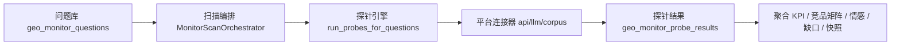
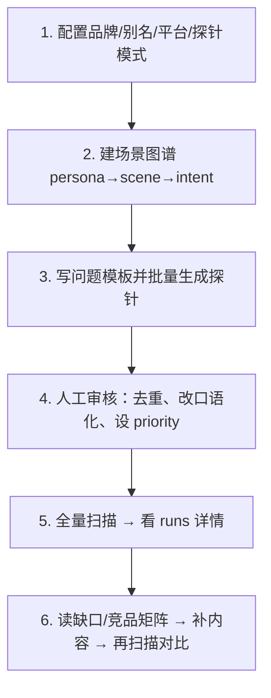
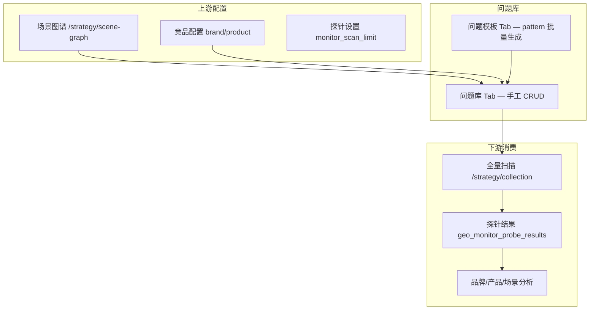
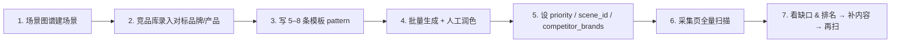

GEOFlow 的「探针」本质是 **AIVIS 数据采集层**：用一组模拟用户提问，向多个 AI 平台发起查询，再解析回答中的品牌提及、排名、情感与竞品，驱动可见性监控与诊断报告。

口径升级（知识库真源）：探针按 **A 框架轨 / B 引用轨 / C 回答轨** 分层采样，模型走组合验证方案。完整方案见 `技术品牌战术/GEO/系统设计/GEO三层探针体系方案.md`。本文件仍描述当前实现；`tracks` / `scheme` 落地前，C 对应现有回答解析，B 对应 `probe_citations`，A 仅 C 端 `thinking_text` 与主题挖掘消费。

---

## 1. 探针在系统中的位置



核心链路：

- **问题** → `geo_monitor_questions`（含 `query_type`、`priority`、`competitor_brands`）
- **执行** → `monitor_probe.py` 对每个问题 × 每个平台发起探针
- **落库** → `geo_monitor_probe_results`（`brand_rank`、`mentioned`、`snippet`、`engine`、`ranking_score`、`sentiment`）
- **后处理** → 情感分析、场景缺口、竞品矩阵、日快照、告警

---

## 2. 探针问题如何设计（最重要）

探针质量直接决定监控可信度。GEOFlow 按 AIVIS 五层漏斗组织：

```
用户画像 → 场景 → 意图 → Query（探针问题）→ AI 引用/提及
```

### 2.1 三类问题

| 类型 | `query_type` | 示例 | 用途 |
|------|-------------|------|------|
| 品牌场景 | `brand` | 「吉利电池技术怎么样？」 | 品牌可见性、好感度 |
| 产品场景 | `product` | 「银河E8城市NOA体验如何？」 | 产品可见性、场景覆盖 |
| 竞品对比 | `competitor` | 「20万纯电SUV哪个智驾最好？」 | 竞品矩阵、差距量化 |

### 2.2 好探针问题的 5 条原则

1. **像真实用户提问**：口语化、带场景，避免内部术语（如「神盾电池」应写成用户会搜的说法）。
2. **一题一意图**：不要在一个问题里混品牌认知 + 产品对比 + 价格。
3. **覆盖高权重场景**：在 `geo_monitor_scenes` 里按 `weight_pct` 分配问题数量（高权重场景多配探针）。
4. **设置优先级**：`priority` 0–100，核心业务问题 80+，长尾 30–50；扫描按优先级排序，受 `monitor_scan_limit` 限制。
5. **绑定竞品**：`competitor_brands` 填该场景下的对标品牌/产品，便于解析 `competitor_mentions`。

### 2.3 推荐规模（参考操作指南）

- 起步：**10–20 个核心探针**，每周全量扫描
- 对标 AIVIS 完整报告：品牌 450 题 × 6 平台、产品 87 题 × 6 平台（可用模板批量生成）

模板示例（`QuestionBankPanel` 已支持）：

```
{brand}怎么样？
{product}和{competitor}哪个更好？
{scene}推荐哪个品牌？
```

---

## 3. 探针执行引擎设计

### 3.1 探针模式

在 **探针设置** / 环境变量中：

| 模式 | 说明 | 适用阶段 |
|------|------|----------|
| `corpus` | 用已发布文章 + 知识库语料做关键词匹配，模拟排名 | 开发/Mock、无 API Key |
| `llm` | LLM 按平台风格模拟回答（仅前 5 题，控制 Token） | 中期验证 |
| `api` | 真实调用豆包/DeepSeek Chat API（主轨 open_api） | 生产日常 Top3 / lift |
| `cend_browser` | Playwright 持久 Profile 采 C 端 Web（辅轨 cend_sample） | 金标：思考/资料链/结构化排名 |

主轨降级（`registry.py`，仅 api/llm/corpus）：

```
api →（失败）→ llm（前5题）→ corpus（兜底）
```

C 端为**独立任务** `run_cend_probe_scan`，不进入 daily 扫描，避免污染北极星 KPI。

#### C 端辅轨（2026-08）

- 适配器：`platform_connectors/cend/`（元宝/豆包/通义/Kimi/文心/DeepSeek）
- API：`POST /strategy/cend/scan`、`POST /strategy/cend/ingest`、`GET /strategy/cend/profile-status`
- 环境：`CEND_PROFILE_ROOT`、`CEND_MOCK_MODE`、`CEND_SCAN_PLATFORMS`、`CEND_HEADLESS`
- 登录：人工扫码写入持久 Profile；不绕过验证码
- 规模：默认 limit≤5，硬顶 20 题/次；资料链 `evidence_level=L2`
- api 答文 URL 同步落 `probe_citations`（L1 / source=api_extract）
- 三层口径（ADR-012）：`scheme` / `tracks` / `reasoning_grade` / `framework`
  - 日扫 `scheme=open_api`、`tracks=[C]`，`metric_kind=open_api`
  - 框架轨 `POST /api/admin/strategy/framework/scan` → `scheme=framework_api`，明文 CoT，**不覆盖** `visibility_open_api`
  - 引用轨 `POST /api/admin/strategy/citation/scan` → `scheme=citation_grounded`，答文 URL / 资料链，**不覆盖** KPI
  - 交叉判定 `GET /api/admin/strategy/cross-track`：信源缺口 / 形态缺口 / 金标
  - 主题挖掘只消费 `reasoning_grade=raw`，禁止 snippet 冒充思维链
  - GEOweb 主机 = official（`domain_official`）；wikipedia / 百度百科 = wiki

每个探针产出统一结构 `ProbeOutcome`：

```python
# 核心字段
brand_rank      # 品牌在回答中的推荐位次（1-6）
mentioned       # 是否被提及
snippet         # 回答摘录（240字）
ranking_score   # 加权分：1位=6分, 2位=5分 ... 6位=1分
engine          # corpus / llm / api / cend_browser / skipped
# C 端扩展
thinking_text / thinking_ms / keywords / rank_blocks / decision_table
citation_urls (L2) / source_hosts / metric_kind
scheme / tracks / reasoning_grade / framework（ADR-012）
```

### 3.2 六平台矩阵

默认平台：`doubao`、`deepseek`、`tongyi`、`yuanbao`、`wenxin`、`kimi`

（open_api 真调仍以豆包/DeepSeek 为主；其余平台走 C 端辅轨或降级。）

### 3.3 语料输入

探针会加载：

- 已发布 `Article`（最近 80 篇）
- `KnowledgeBase` 条目
- 站点 `brand_name` / `brand_aliases`（最多 12 个关键词）

**设计含义**：内容越丰富、与探针问题越相关，语料模式下的「可见性」越高——这本身就是在测「你的 GEO 内容是否被 AI 采信」。

---

## 4. 指标与告警设计

扫描完成后自动聚合（`aggregate_probe_kpis`）：

| 指标 | 计算方式 | 业务含义 |
|------|----------|----------|
| 可见性 `visibility_pct` | 提及次数 / 总探针数 | 品牌在 AI 回答中的出现率 |
| 平均排名 `avg_brand_rank` | 有排名探针的算术平均 | 推荐位次（越小越好） |
| 加权排名 `weighted_rank_score` | 按位次权重加权 | 综合推荐强度 |
| 好感度 `sentiment_score` | 正向 / (正向+负向) | 提及时的情感倾向 |
| 平台矩阵 `platform_matrix` | 分平台可见性/排名 | 平台渗透差异 |

配合：

- **场景缺口**（`scene_gap_analyzer`）：某场景下有问题但无内容支撑 → 指导内容生产
- **竞品矩阵**（`competitive_analyzer`）：6 平台 × N 品牌对标
- **日快照**（`geo_monitor_snapshots`）：趋势追踪
- **告警**（`monitor_alerts`）：可见性/排名异常

---

## 5. 推荐设计流程（实操）



**阶段建议：**

1. **MVP（1 天）**：10 个品牌类问题 + `corpus` 模式 + 每周扫描
2. **验证（1 周）**：接入 `llm` 模式，对比语料 vs LLM 差异
3. **生产**：配置 `DEEPSEEK_API_KEY` / `DOUBAO_API_KEY`，切 `api` 模式
4. **完整 AIVIS**：场景图谱 + 模板批量生成 + 品牌/产品双轨 + 竞品矩阵报告

---

## 6. 设计注意事项

| 点 | 建议 |
|----|------|
| 扫描成本 | 探针数 × 平台数 = 总调用量；50 题 × 6 平台 = 300 次/扫描 |
| LLM 限额 | 仅前 5 题走 LLM，其余降级语料 |
| API 覆盖 | 目前真实 API 仅豆包/DeepSeek MVP，其他平台走降级 |
| 问题质量 > 数量 | 20 个精准问题比 200 个泛化问题更有诊断价值 |
| 与 GEO 内容联动 | 探针低分 + 场景缺口高 → 优先写/优化对应 Wiki/文章 |

---

## 7. 与现有代码的对应关系

详见 **§9 模块索引**。

---

**一句话总结**：GEOFlow 探针 = **「场景化用户问题」×「多平台采集」×「统一解析」×「内容缺口闭环」**。设计重心应放在问题库（场景覆盖、意图单一、竞品绑定），而不是连接器本身；连接器已有三级降级，问题设计才是探针准确性的瓶颈。

> **进阶专题**：Open-API 与 C 端真值偏差、Citation/限流/Rank 解析 → 见 [探针真值标定专题](./探针真值标定专题.md)。

---

## 8. 问题库设计（`/strategy/question-bank`）

问题库是 AIVIS 的 **Query 层入口**：所有探针扫描从这里取题。页面位于策略中心第二梯队（诊断 → 数据采集 → **问题库** → 品牌/产品分析）。



### 8.1 探针 Hub 信息架构（`/strategy/probes`）

探针入口已收敛为 **一套问题库 + 四套 scheme 扫描 + 交叉判定 + 金标脚注**：

| `?view=` | 标签 | 职责 | 组件 |
|----------|------|------|------|
| `scan`（默认） | 采集工作台 | 四套 scheme 卡片：上次运行 / 预估题量 / 一键扫描 | `CollectionPanel` |
| `questions` | 监控问题库 | 手工 CRUD、模板生成、CSV 导入 | `QuestionBankPanel` |
| `cross` | 交叉判定 | A∩B∩C 标志；信源/形态缺口可 spawn Theme | `CrossTrackPanel` |
| `gold` | 金标对照 | 人工金标与 Open-API 偏移脚注，**不覆盖**北极星 | `GoldLabelsPanel` |
| `settings` | 探针设置 | 品牌/平台/模式/域名目录 | `ProbeSettingsForm` |

旧路径 `/strategy/gold-labels`、`/strategy/collection`、`/strategy/question-bank`、`/strategy/settings` 均 301/replace 进本 Hub。

A/B 辅轨扫描平台跟 **探针设置**（`probe_settings.platforms`），不再写死 doubao/kimi。C 端金标仍默认 yuanbao。

官域目录空时保底 `geely.com,zeekrlife.com`；`brand_aliases` 支持 JSON 数组。Hub 日扫后处理失败不再回滚探针。交叉「生成 Theme」会写入 A 轨 `unused_dims`。C 端 skip 仍记 `scheme=cend_sample`。B 轨默认 HEAD 核验 URL（死链 `source=url_dead` / 全死则 evidence 降 L0），`CITATION_LIVE_CHECK=false` 可关。

**采集工作台四卡：**

| scheme | tracks | 计入北极星 |
|--------|--------|------------|
| `open_api` 日常 C 轨 | C | 是（`visibility_open_api`） |
| `framework_api` A 框架轨 | A+C | 否 |
| `citation_grounded` B 引用轨 | B+C | 否 |
| `cend_sample` C 端金标 | B+C | 否 |

问题库 Tab 内部仍分：问题列表、问题模板、CSV 导入；最近扫描链到 `/strategy/monitor/runs/[id]`。

**与相邻页面的分工：**

- **场景图谱**（`/strategy/scene-graph`）：定义 Persona → Scene → Intent，计算 `gap_rate`
- **问题库**（Hub 内）：把意图落成可执行的 Query 文本
- **采集工作台**（Hub 内）：按 scheme 触发扫描，消费问题库
- **可见性**（`/strategy/visibility`）：只读 C 轨 KPI，不在此触发辅轨

### 8.2 数据模型

#### 核心表 `geo_monitor_questions`

| 字段 | 类型 | 说明 |
|------|------|------|
| `question_text` | Text | 探针问题正文（必填） |
| `priority` | Int 0–100 | 扫描排序权重，越高越先执行 |
| `status` | `active` / `paused` | 仅 `active` 参与扫描 |
| `query_type` | `brand` / `product` / `competitor` | 决定 KPI 分轨聚合 |
| `scene_id` | FK → `geo_monitor_scenes` | 关联场景，驱动缺口分析 |
| `template_id` | FK → `geo_monitor_query_templates` | 标记来源模板 |
| `competitor_brands` | JSON `string[]` | 该题对标的竞品名列表 |
| `last_scan_at` | DateTime | 上次被扫描时间 |

#### 模板表 `geo_monitor_query_templates`

| 字段 | 说明 |
|------|------|
| `pattern` | 含占位符的句式，如 `{brand}电池安全吗？` |
| `template_type` | 生成问题的 `query_type` |
| `scene_id` | 可选，生成时写入问题的 `scene_id` |
| `default_priority` | 生成问题的默认优先级 |

**占位符约定**（`generate_questions_from_template`）：

| 占位符 | 默认填充（批量生成时） | 建议替换为 |
|--------|------------------------|------------|
| `{brand}` | 「品牌」 | `site_settings.brand_name` |
| `{product}` | 「产品」 | 产品配置中的具体车型/系统 |
| `{competitor}` | 「竞品」 | `geo_monitor_competitors` 列表 |
| `{scene}` | 「场景」 | `geo_monitor_scenes.scene_name` |

> 当前模板生成使用占位默认值，生成后需人工替换为真实实体名——这是问题库运维的关键步骤。

### 8.3 API 与扫描消费逻辑

| 方法 | 路径 | 说明 |
|------|------|------|
| GET | `/api/admin/strategy/monitor` | 聚合面板，含 questions（限 50 条） |
| POST | `/api/admin/strategy/monitor/questions` | 创建问题 |
| PATCH | `/api/admin/strategy/monitor/questions/{id}` | 更新问题 |
| DELETE | `/api/admin/strategy/monitor/questions/{id}` | 删除问题 |
| POST | `/api/admin/strategy/monitor/templates` | 创建模板 |
| POST | `/api/admin/strategy/monitor/templates/{id}/generate` | 从模板批量生成（最多 20 条） |
| POST | `/api/admin/strategy/monitor/scan` | 触发全量扫描 |

**扫描取题规则**（`MonitorScanOrchestrator._load_questions`）：

```sql
SELECT id, question_text, priority, competitor_brands
FROM geo_monitor_questions
WHERE status = 'active'
ORDER BY priority DESC, id ASC
LIMIT :monitor_scan_limit   -- 默认 50，最高 500
```

单次扫描探针数 = `有效问题数 × 平台数`（默认 6 平台）。

### 8.4 问题分类与配比设计

#### 三类问题的诊断用途

| `query_type` | 计入面板 | 典型句式 | 建议占比 |
|--------------|----------|----------|----------|
| `brand` | 品牌可见性 | 「XX 品牌技术实力如何？」 | 50–60% |
| `product` | 产品可见性 + 场景漏斗 | 「XX 车型智驾体验怎么样？」 | 30–40% |
| `competitor` | 竞品矩阵 | 「A 和 B 哪个智驾更好？」 | 10–20% |

#### 优先级分层

| 层级 | priority | 场景 | 扫描行为 |
|------|----------|------|----------|
| P0 核心 | 90–100 | 品牌主战场、TOP3 高权重场景 | 每次必扫（在 limit 内） |
| P1 重要 | 70–89 | 次要场景、主力产品 | 常规周扫 |
| P2 观察 | 50–69 | 长尾意图、新兴话题 | 月度或 limit 充裕时 |
| P3 暂停 | — | 过时/重复题 | `status=paused`，不扫描 |

#### 场景绑定原则

每个 `scene_id` 至少配 **1 条 product 类 + 1 条 competitor 类** 问题，使 `scene_gap_analyzer` 能计算：

```
gap_rate = 无内容支撑的问题数 / 该场景问题总数
```

高 `gap_rate` + 高 `weight_pct` 场景 → 优化优先级最高。

### 8.5 问题撰写规范（Do / Don't）

**Do：**

- 使用用户口语：「20 万纯电 SUV 买哪款智驾好？」
- 带使用场景：「通勤堵车用城市 NOA 哪个品牌稳？」
- 竞品题写明价位/品类边界：「30 万内混动轿车推荐」
- 一题一意图，便于归因到单一 `scene_id`

**Don't：**

- 内部代号直出：「神盾电池」→ 应写「电池安全技术」
- 复合问题：「XX 品牌怎么样，价格多少，和 YY 比如何？」
- 无法被 AI 回答的封闭式问题：「XX 4S 店电话多少？」
- 重复语义：同一意图写 5 个近义问法（浪费扫描配额）

### 8.6 问题库建设流程（推荐 SOP）



**阶段目标：**

| 阶段 | 问题规模 | 动作 |
|------|----------|------|
| 冷启动 | 10–15 题 | 手工录入 P0 品牌题 + 3 条竞品对比 |
| 结构化 | 30–50 题 | 场景绑定 + 模板批量生成 + 去重 |
| 完整 AIVIS | 100–500 题 | TJG 报告导入或模板矩阵展开 |

### 8.7 模板库设计（问题模板 Tab）

推荐预置模板矩阵：

**品牌类：**

```
{brand}怎么样？
{brand}和{competitor}哪个更好？
{brand}的核心技术优势是什么？
买{scene}选{brand}靠谱吗？
```

**产品类：**

```
{product}智驾体验如何？
{product}和{competitor}怎么选？
{scene}适合买{product}吗？
```

**竞品类：**

```
{scene}推荐哪个品牌？
{competitor}和{brand}哪个{scene}更强？
20万{scene}有哪些值得买？
```

模板 `category` 字段可用于分组（如「电池安全」「城市NOA」「价格对比」），便于运营检索。

### 8.8 示例问题清单（汽车智驾，可直接导入）

| question_text | query_type | priority | competitor_brands |
|---------------|------------|----------|-------------------|
| 吉利汽车整体口碑怎么样？ | brand | 95 | 比亚迪,长安 |
| 吉利电池安全技术靠谱吗？ | brand | 90 | 比亚迪,宁德时代 |
| 银河E8城市NOA体验如何？ | product | 92 | 小鹏P7,比亚迪汉 |
| 20万纯电轿车智驾怎么选？ | competitor | 88 | 小鹏,比亚迪,吉利 |
| 通勤堵车用城市NOA哪个品牌好？ | competitor | 85 | 华为,小鹏,吉利 |
| 千里浩瀚智驾和华为ADS比怎么样？ | product | 90 | 华为ADS,小鹏XNGP |
| 吉利神盾电池和比亚迪刀片电池哪个更安全？ | competitor | 80 | 比亚迪 |
| 家庭用车选吉利银河系列合适吗？ | product | 75 | 比亚迪,长安 |

### 8.9 与下游分析的映射

| 问题库字段 | 下游消费方 | 产出 |
|------------|------------|------|
| `query_type=brand` | `aggregate_probe_kpis(query_type='brand')` | 品牌可见性面板 |
| `query_type=product` | 产品面板 + `SceneFunnel` | 场景漏斗 |
| `competitor_brands` | `probe_platform` → `competitor_mentions` | 竞品矩阵 |
| `scene_id` | `compute_scene_gap` | 缺口优先级 |
| `priority` | 扫描排序 | 配额内优先覆盖核心题 |

### 8.10 当前实现差距与演进建议

| 项 | 状态 |
|----|------|
| 场景 / 竞品 / 状态表单 | ✅ 已实现 |
| 分页 + 筛选 API | ✅ `GET /strategy/monitor/questions` |
| CSV 批量导入 | ✅ `POST /strategy/monitor/questions/bulk` |
| 单题探针结果联查 | ✅ 列表「探针」按钮 → citations API |
| 模板生成注入真实实体 | ✅ 已实现 |

### 8.11 运维检查清单

每次变更问题库后，扫描前确认：

- [ ] `active` 问题数 × 平台数 ≤ 可接受 API 成本
- [ ] P0 题（priority ≥ 90）均在 `monitor_scan_limit` 覆盖范围内
- [ ] 每个高权重场景至少有 1 条绑定问题
- [ ] 竞品题已填写 `competitor_brands`
- [ ] 无近义重复（语义相似度 > 80% 应合并）
- [ ] 问题文本已替换模板占位符为真实品牌/产品名

---

## 9. 模块索引

| 模块 | 文件 |
|------|------|
| 探针执行 | `geoflow-v3/backend/app/services/geoeval/monitor_probe.py` |
| 扫描编排 | `geoflow-v3/backend/app/services/geoeval/monitor_scan.py` |
| C 端辅轨 | `geoflow-v3/backend/app/services/geoeval/cend_scan.py` + `platform_connectors/cend/` |
| 框架轨扫描 | `geoflow-v3/backend/app/services/geoeval/framework_scan.py` |
| 口径 | `geoflow-v3/backend/app/services/geoeval/probe_scheme.py` |
| 框架抽取 | `geoflow-v3/backend/app/services/geoeval/framework_extractor.py` |
| 平台连接器 | `geoflow-v3/backend/app/services/geoeval/platform_connectors/` |
| 问题 CRUD | `geoflow-v3/backend/app/services/admin/strategy_crud_service.py` |
| 场景/模板/竞品 | `geoflow-v3/backend/app/services/admin/monitor_aivis_service.py` |
| 问题库 UI | `geoflow-v3/apps/geoflow-admin/components/strategy/QuestionBankPanel.tsx` |
| 策略页路由 | `geoflow-v3/apps/geoflow-admin/app/(dashboard)/strategy/[tab]/page.tsx` |
| TJG 报告导入 | `geoflow-v3/backend/app/services/geoeval/tjg_report_parser.py` |
| AIVIS 总设计 | `guide/AI可见性诊断系统_AIVIS_设计方案_20260703.md` |