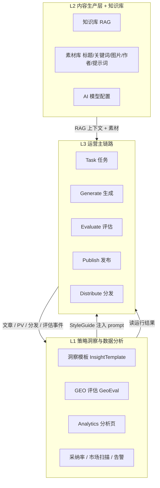
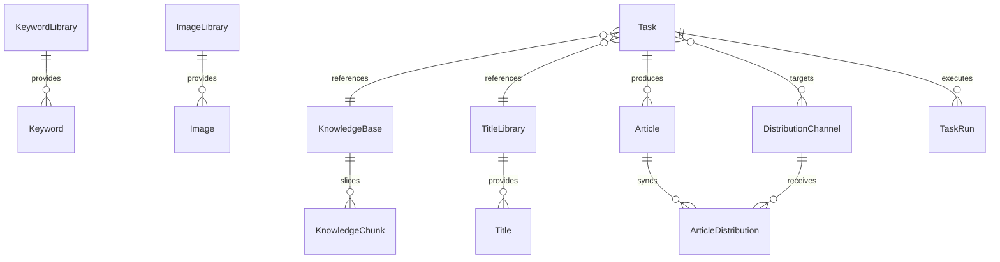

# GEOFlow 系统设计学习笔记

> 面向团队共读：从 GEOFlow 源码与文档中提炼 **前端设计、系统架构设计、数据设计** 的可复用思路。  
> 重点不是功能清单，而是「为什么这样设计、能复用到哪里」。

---

## 阅读指引

| 章节 | 适合谁 | 核心问题 |
|------|--------|----------|
| 零、业务分层 | 产品、全员 | 系统按业务分成哪几层？各层如何衔接？ |
| 一、前端设计 | 产品、前端、全栈 | 后台/前台/API 如何分层？主题与导航如何扩展？ |
| 二、系统架构设计 | 后端、架构、DevOps | 主链路与副作用如何隔离？队列与策略如何扩展？ |
| 三、数据设计 | 后端、DBA、架构 | 表结构如何跟随业务流水线？状态与同步如何建模？ |
| 四、技术三层贯通 | 全员 | 前端 / 架构 / 数据如何对齐？ |

相关文档：`README.md`（运行结构）、`guide/langgraph-orchestration.md`（Content Agent LangGraph 编排）、`docs/geo-strategy-architecture.md`（GEO 评估）、`docs/distribution/multi-platform-distribution-plan.md`（分发方案）。

> **两种「三层」**：本章（零）讲 **业务分层**——策略洞察、内容生产、运营主链路；第四讲 **技术分层**——前端、架构、数据。二者正交，可对照阅读。

---

## 零、业务分层

从产品视角，GEOFlow 可归纳为三个业务层。这比「按技术栈切分」更贴近日常运营与团队协作语言。

### 0.1 三层总览



| 层 | 回答的问题 | 典型模块 / 入口 |
|----|------------|-----------------|
| **L1 策略洞察与数据分析** | 内容好不好？AI 有没有引用？该怎么写？ | `/admin/strategy` Hub、`geo:monitor-scan`、`InsightTemplate`、`GeoEval`、`geo:market-scan` |
| **L2 内容生产层 + 知识库** | 用什么资料、什么风格、什么模型来生产？ | 知识库、素材库、AI 配置、RAG 切片与召回 |
| **L3 运营主链路** | 怎么稳定、可追踪地跑起来？ | Task → Worker → Article → 评估 → 发布 → 分发队列 |

### 0.2 L3 运营主链路（执行引擎）

这是系统的 **执行核心**，一步接一步：

```
Task（配置 + 调度）
  → Generate（WorkerExecutionService：选题 + RAG + AI 正文）
  → Evaluate（ArticleEvaluationService，可选门禁）
  → Publish（草稿 / 审核 / 按 publish_interval 发布）
  → Distribute（DistributionOrchestrator → 各渠道 Publisher）
```

关键设计：

- **Task 是编排中心**：绑定素材库、知识库、模型、`publish_scope`、分发渠道
- **评估独立状态轴**：`eval_status` 不污染 `status` / `review_status`
- **分发是副作用**：`publish_scope = local_only` 时整条分发链跳过（见第二章 2.1）

对应队列：`geoflow`（生成/发布）→ `geo_eval`（评估 Job）→ `distribution`（同步）→ `default`（知识库切片等）。

### 0.3 L2 内容生产层 + 知识库（输入工厂）

这层 **不直接跑调度**，而是为 L3 沉淀可复用的生产要素：

| 能力 | 作用 | 注入 L3 的方式 |
|------|------|----------------|
| 知识库 | 切片、向量化、混合召回 | `Task.knowledge_base_id` → `KnowledgeRetrievalService` |
| 标题库 / 关键词库 | 选题与 SEO | `Task.title_library_id`、关键词采样 |
| 图片库 / 作者 | 正文插图与署名 | `Task.image_library_id`、`author_id` |
| 提示词 | 正文写作指令 | `Task.prompt_id` |
| AI 配置 | chat / embedding 模型 | `Task.ai_model_id` |

**可记**：L2 = **静态能力沉淀**；L3 = **动态执行**。

生成时跨层连接示例（`WorkerExecutionService`）：

- `knowledge_base_id` → RAG 上下文拼入 prompt
- `insight_template_id` → L1 洞察模板追加 StyleGuide（见 0.4）

### 0.4 L1 策略洞察与数据分析（大脑 + 后视镜）

L1 有两条腿，建议分开理解：

| 子能力 | 时机 | 作用 | 代表实现 |
|--------|------|------|----------|
| **洞察模板** | 生成**前** | URL / 竞品 → StyleGuide，注入写作 prompt | `InsightTemplateService` |
| **GEO 评估** | 生成**后** | 模拟 RAG / 审计，门禁或诊断 | `InternalGeoEvalEngine`、`ArticleEvaluationService` |
| **数据分析** | 发布**后** | PV、AI 爬虫、分发健康、任务/素材健康 | `AnalyticsOverviewService`、`GeoEvalAnalyticsService` |

定时任务也属于 L1：`geo:aggregate-adoption-metrics`、`geo:market-scan`、`geo:check-adoption-alerts`（见 `routes/console.php`）。

**可记**：L1 既 **影响怎么写**（洞察），又 **判断写得怎样、投出去怎样**（评估 + 分析）。

### 0.5 三层依赖与闭环

> **L2 备料 → L3 执行 → L1 观测并反哺策略。**

典型闭环：

1. 在知识库沉淀真实业务资料（L2）
2. 创建 Task，可选绑定洞察模板（L1 → L3）
3. 调度生成 → 评估 → 发布 → 分发（L3）
4. Analytics 查看爬虫、PV、分发成功率（L1 ← L3）
5. 根据洞察更新模板或知识库（L1 → L2）

### 0.6 与后台导航的对应

| 后台入口 | 所属业务层 |
|----------|------------|
| 素材管理、AI 配置 | L2 |
| 任务管理、文章、分发 | L3 |
| 效果与策略 Hub（监控库 / 外部信源 / 仿真 / 采纳） | L1 |
| 数据分析（PV / 分发健康，非 GEO 区块） | L1 后视镜 |

Dashboard 首页同时展示 L2 配置入口、L3 运行健康、L1 分发/导入状态，便于一眼判断：**备料够不够 → 链路通不通 → 效果好不好**。

### 0.7 业务分层 vs 技术分层

| 维度 | 业务分层（本章） | 技术分层（第四） |
|------|------------------|------------------|
| 划分依据 | 产品职责与运营阶段 | 工程实现与代码组织 |
| 典型层次 | 洞察 / 生产 / 主链路 | 前端 / 架构 / 数据 |
| 沟通场景 | 产品规划、运营分工、需求评审 | 代码评审、模块拆分、表结构设计 |

同一功能常同时落在两层：例如「分发」在业务上属于 L3 主链路末端，在技术上涉及独立队列（架构）与 `article_distributions` 表（数据）。

---

## 一、前端设计

### 1.1 后台与前台彻底分离

GEOFlow 没有强行用一套 SPA 覆盖所有场景：

| 区域 | 技术 | 设计意图 |
|------|------|----------|
| 管理后台 | Blade + Tailwind CDN | 表单密集、迭代快、SEO 无关 |
| 内容前台 | Blade + 主题包 | 面向爬虫与用户，SEO / Schema 优先 |
| 自动化集成 | REST API（`/api/v1`） | 给脚本/第三方用，不绑 UI |

**可学点**：管理端和内容端用户目标不同，分开比「一个大前端」更合理。内容产品尤其如此——前台是「信源」，后台是「工厂」。

### 1.2 统一布局 + 局部组合

后台骨架（`resources/views/admin/layouts/app.blade.php`）非常克制：

- **一个 layout**：CSRF、flash、Tailwind、Lucide 图标统一加载
- **partials 拆分**：`header` / `footer` / `welcome-modal` 各司其职
- **页面只关心业务**：`@extends('admin.layouts.app')` + `@section('content')`

**可学点**：先建立「壳」，再填「肉」。比每个页面重复写 `<head>` 更可维护。

### 1.3 导航映射表：路由 → 高亮菜单

`resources/views/admin/partials/header.blade.php` 用 `$menu` + `$subMap` 解决「子页面归属哪个一级菜单」：

```php
$menu = [
    'dashboard' => ['route' => 'admin.dashboard', 'name' => __('admin.nav.dashboard')],
    'tasks'     => ['route' => 'admin.tasks.index', 'name' => __('admin.nav.tasks')],
    // ...
];

$subMap = [
    'admin.knowledge-bases.index' => 'materials',
    'admin.title-libraries.index' => 'materials',
    // ...
];

$routeName = request()->route()?->getName();
if ($resolvedActive === '' && $routeName && isset($subMap[$routeName])) {
    $resolvedActive = $subMap[$routeName];
}
```

**可学点**：深层路由（如 `knowledge-bases/edit`）不必每个控制器传 `activeMenu`，用映射表集中维护。新增模块时只改一处。

### 1.4 仪表盘 = 运营导航，不是数据墙

2.0 首页（`DashboardController` + `admin/dashboard.blade.php`）按 **业务链路** 组织：

- 单站点运营：素材 → 任务 → 文章
- 多站点分发：渠道健康、队列状态
- 健康度卡片：`ready / running / warning / error` 语义色

控制器把聚合逻辑放在 PHP 层（`buildTaskHealth()`、`buildMaterialHealth()` 等），视图只做展示映射。

**可学点**：Dashboard 的首要任务是 **引导下一步操作**，其次才是数字。颜色和状态语义要统一（emerald = 正常、amber = 注意、red = 异常）。

### 1.5 主题包机制：可插拔、零编译

`App\Support\Site\SiteThemeCatalog` 扫描 `resources/views/theme/{id}/`：

- 有 `manifest.json` 则读元数据（name、version、description）
- 否则检查 `home.blade.php` 是否存在
- 每个主题自带 `layout / home / article / category / assets/theme.css`

后台切换主题即可换皮，不影响内容数据。

**可学点**：内容系统的前端应该是 **主题包**，不是写死在 layout 里。manifest 让主题可发现、可描述、可版本化。

### 1.6 ViewComposer 注入公共上下文

`App\View\Composers\SiteLayoutComposer` 为所有前台页面自动注入：

- `siteName`、`siteLogo`、`siteFavicon`
- `navCategories`（仅含已发布文章的分类）
- `headAnalyticsCode`

**可学点**：布局级数据不要每个 Controller 重复 `with()`，用 Composer 一次注入。

### 1.7 i18n 从第一天就进架构

- 后台 6 语言，`__('admin.xxx')` 全覆盖
- 登录页、欢迎弹窗、导航、错误页都有翻译键
- 前台 locale 与后台 session locale **独立**（中间件 `site.locale` vs `admin.locale`）

**可学点**：国际化 = **路由中间件 + 语言包 + 独立 locale 作用域**，三件事一起做，不是后贴标签。

### 1.8 轻量前端栈的取舍

- Tailwind Play CDN（无 Vite 构建链也能跑）
- Lucide 图标
- 分析页用 Blade partial 拆分（`_kpis`、`_line-chart`、`_filters`、`_distribution-section`）

**可学点**：B 端后台不必默认上 React。表单 + 列表 + 状态卡片，Blade + Tailwind 足够；把复杂度留给业务层。

### 1.9 前台 SEO / GEO 友好输出

前台 layout（`resources/views/site/layout.blade.php`）预留：

- `canonical`、`description`、`keywords`
- `@stack('head')` 供文章页注入 Open Graph、Schema
- 主题与 Agent 远端站点同步输出 `sitemap`、`llms.txt`、独立 CSS

**可学点**：GEO 类产品的前端设计目标之一是 **可被 AI 与搜索引擎稳定理解**，布局层要预留扩展点，而不是事后硬塞 meta。

### 1.10 后台状态可见性（L3 主链路 UI 约定）

运营在 L3 需要沿 **任务 → 文章 → 分发** 看见后端语义，避免误判「任务卡死」：

| 位置 | 展示字段 | 数据来源 |
|------|----------|----------|
| 任务列表 | `publish_scope` 徽章；`eval_pending_count` / `eval_failed_count` 提示 | `TaskMonitoringQueryService` |
| 任务状态 chip | `draft_pool_full` 在 eval 阻塞时改为「草稿待评测」类文案 | 同上 + `eval_blocked_drafts` |
| 文章编辑 | `eval_status` 状态条、失败原因、复评入口；`distribution_only` 说明 | `ArticleController::edit` |
| GEO 诊断 | 失败项跳转任务 / 知识库 / 洞察模板 | `GeoEvalAnalyticsService::recentFailures` |
| AI 配置 | RAG 切片/检索全局参数 | `KnowledgeSettingsController` → `KnowledgeConfigService` |

导航约定：L1（GEO 评估、洞察模板）集中在顶栏；素材 Hub 仅保留 L2 入口 + 一行 L1 引导。移动端菜单按 L2 / L3 / L1 分组。

---

## 二、系统架构设计

### 2.1 第一性原理：主链路稳定，副作用异步

> **站内发布是主链路，外部分发是副作用。**

（见 `docs/distribution/multi-platform-distribution-plan.md`）

- 第三方 API 失败 **不回写** 文章 `status=failed`
- 分发走独立队列 `distribution`
- 同步 HTTP 请求不放在页面请求里

这是 GEOFlow 架构的 **第一性原理**，后面所有模块都服从它。

### 2.2 分层清晰：Controller 薄、Service 厚

```
Controller  →  参数校验 + 视图 / API 响应
Service     →  业务规则（生成、RAG、分发、评估）
Job         →  长耗时、可重试的异步步骤
Support     →  无状态工具（Workflow、Crypto、Classifier）
Ai/Agents   →  Laravel AI SDK 封装（如 MarkdownContentWriterAgent）
```

例如 `WorkerExecutionService` 串起：选题 → RAG → AI 生成 → 插图 → 写库 → 评估 → 发布 → 触发分发。Controller 不碰这些。

**可学点**：AI 产品的复杂度在 **编排**，不在 HTTP 层。编排逻辑必须可单测、可日志、可重入。

### 2.3 双队列隔离

| 队列 | Job | 隔离原因 |
|------|-----|----------|
| `geoflow` | `ProcessGeoFlowTaskJob` | AI 生成慢，超时 300s |
| `distribution` | `ProcessArticleDistributionJob` | 外部 HTTP 不可控 |
| `default` | `EvaluateArticleJob` | GEO 评估可独立扩缩 |

Horizon 可按队列分别监控、限流、扩容。

**可学点**：不同 SLA 的任务进不同队列，避免慢任务拖死快任务。

### 2.4 调度与执行分离

```
Scheduler（每分钟 geoflow:schedule-tasks）
    → 创建 TaskRun
    → dispatch ProcessGeoFlowTaskJob

Worker（queue:work）
    → WorkerExecutionService::executeTask()
    → 回写 task_runs / tasks / worker_heartbeats
```

`ProcessGeoFlowTaskJob` 设计要点：

- Laravel 层 `tries = 1`，避免与业务重试双重重试
- 业务重试由 `JobQueueService` 控制
- `tags()` 供 Horizon 按 `task_id` 聚合

**可学点**：调度（when）和执行（how）分开；重试策略只在一处定义。

### 2.5 策略模式扩展分发渠道

`DistributionPublisherManager` 按渠道类型路由：

```php
return match ($channel->channelType()) {
    'geoflow_agent'    => $this->geoFlowAgentPublisher,
    'wordpress_rest'   => $this->wordPressRestPublisher,
    'generic_http_api' => $this->genericHttpApiPublisher,
    default            => throw new RuntimeException(...),
};
```

统一接口 `DistributionPublisherInterface`：

- `health()` — 健康检查
- `publish()` / `update()` / `delete()` — 内容同步
- `syncSiteSettings()` — 远端站点配置同步

**可学点**：新增渠道 = 新 Publisher + Manager 注册一行，不改 `DistributionOrchestrator` 核心逻辑（开闭原则）。

### 2.6 发布范围三态：产品规则进模型

`Task.publish_scope`：

| 值 | 行为 |
|----|------|
| `local_and_distribution` | 本地 + 渠道同时发布 |
| `local_only` | 禁用渠道，不进分发队列 |
| `distribution_only` | 只推远端，本地可 private |

`DistributionOrchestrator::enqueueForArticle()` 入口处统一判断。

**可学点**：跨模块行为差异，用 **枚举字段 + 单一入口校验**，不要 if/else 散落十处。

### 2.7 GEO 评估作为可插拔门禁

（见 `docs/geo-strategy-architecture.md`）

- `InternalGeoEvalEngine` — 内置引擎，不依赖外部 GEO-OS API
- `ArticleEvaluationService` — 门禁与状态机
- `geo_eval.enabled` — 总开关
- `gate_rollout_percent` — 按 `article_id % 100` 灰度
- `eval_status` — 与 `status`、`review_status` 独立

**可学点**：质量门禁应该是 **可关闭、可灰度、可异步** 的横切能力，不是硬编码在生成流程里。

### 2.8 API 设计规范

- 统一信封：`App\Support\ApiResponse`（`success / data / error / meta.request_id`）
- Sanctum Token + **细粒度 Scope**（`tasks:write`、`articles:publish` 等）
- 幂等键 `api_idempotency_keys` 防重复写
- 中间件链：`api.request_id` → `api.auth` → `api.scope:*`

**可学点**：对外开放 API 时，**信封、追踪 ID、权限粒度、幂等** 四件套应同时设计。

### 2.9 配置与密钥分离

| 类型 | 存储 | 读取方式 |
|------|------|----------|
| 业务配置 | `config/geoflow.php` | `config('geoflow.xxx')`，代码禁止直接 `env()` |
| AI API Key | `ai_models`，`enc:v1` 加密 | `ApiKeyCrypto`，根材料 `APP_KEY` |
| 分发密钥 | `distribution_channel_secrets` | 与渠道配置分表，支持轮转 |

**可学点**：配置、密钥、业务 JSON 三类数据存储方式不同，不要塞进一个 JSON 字段。

### 2.10 可观测性内建

| 机制 | 用途 |
|------|------|
| `distribution_logs` | 分发事件 |
| `geo_eval_event_logs` | GEO 评估追踪 |
| `admin_activity_logs` | 后台操作审计 |
| `view_logs` + `TrafficClassifier` | PV 与 AI 爬虫识别 |
| Job `tags()` | Horizon 按任务维度聚合 |
| `horizon:snapshot` | 队列吞吐时序指标 |

**可学点**：日志不只是 `Log::info`，而是 **结构化事件表 + 分类器**，支撑分析与告警。

### 2.11 部署架构与代码架构对齐

Docker Compose 服务直接对应运行时角色：

| 服务 | 职责 |
|------|------|
| `postgres` | PostgreSQL + pgvector |
| `redis` | 队列、缓存 |
| `app` | HTTP（开发 `artisan serve`，生产 php-fpm） |
| `queue` | `queue:work redis --queue=geoflow,geo_eval,distribution,default` |
| `scheduler` | `schedule:work` |
| `reverb` | WebSocket（任务状态广播） |

生产环境切 `docker-compose.prod.yml`（Nginx + php-fpm），**进程模型不变**。

**可学点**：架构图里的盒子，应能在 `docker-compose.yml` 里一一找到。

### 2.12 RAG 架构要点（跨层）

`KnowledgeRetrievalService` 体现的服务层设计：

- pgvector 向量分数 + 关键词 TF + 标题/章节/metadata 加权
- LLM 语义规划切片边界，**实际切片仍从原文稳定重建**（避免幻觉）
- `KnowledgeChunkSyncService` 负责切片与向量化生命周期

**可学点**：RAG 不是「调 embedding API」一件事，而是 **切片策略 + 混合召回 + 稳定重建** 的组合设计。

---

## 三、数据设计

### 3.1 以「内容工厂流水线」组织实体



**可学点**：表结构跟着 **流水线阶段** 走：输入（素材库）→ 配置（Task）→ 产出（Article）→ 同步（ArticleDistribution）。不是「每个页面一张表」。

### 3.2 库 + 条目：Library 模式

| 库表 | 条目表 | Task 关联 |
|------|--------|-----------|
| `title_libraries` | `titles` | `title_library_id` |
| `keyword_libraries` | `keywords` | （标题 AI 生成时采样） |
| `image_libraries` | `images` | `image_library_id` |
| `knowledge_bases` | `knowledge_chunks` | `knowledge_base_id` |

好处：

- 库可复用、可统计 `used_task_count`
- 条目可批量导入 / AI 生成
- Task 配置简洁，只存库 ID

**可学点**：多值输入用 **Library 模式**，比 Task 上挂 JSON 数组更可查询、可维护。

### 3.3 文章状态多轴设计

`App\Support\GeoFlow\ArticleWorkflow` 分离多个维度：

| 字段 | 取值 | 含义 |
|------|------|------|
| `status` | draft / published / private | 内容可见性 |
| `review_status` | pending / approved / rejected / auto_approved | 审核 |
| `eval_status` | pending_eval / passed / failed / skipped | GEO 评估 |

**可学点**：不要把「审核中」「已发布」「评估失败」揉成一个 status。多轴状态 = 多维度独立演进。

### 3.4 任务：配置表 vs 运行记录表

| 表 | 职责 | 典型字段 |
|----|------|----------|
| `tasks` | 任务配置与调度 | `publish_scope`、`next_run_at`、`next_publish_at`、`draft_limit` |
| `task_runs` | 每次执行记录 | `status`、错误信息、耗时 |
| `worker_heartbeats` | Worker 存活 | 供面板与监控 |

**可学点**：排查「为什么这篇没生成」查 `task_runs`，不是改 `tasks` 配置。

### 3.5 分发域：四表 + 日志闭环

| 表 | 职责 |
|----|------|
| `distribution_channels` | 渠道定义、健康状态、`channel_type` |
| `distribution_channel_secrets` | 密钥轮转、`key_id`、`scopes` |
| `task_distribution_channels` | 任务 ↔ 渠道多对多 + pivot 策略 |
| `article_distributions` | 单篇在某渠道的同步状态机 |
| `distribution_logs` | append-only 事件日志 |

`article_distributions` 关键字段：

- `idempotency_key` UNIQUE — 防重复推送
- `payload_hash` — 内容未变则跳过
- `attempt_count` + `next_retry_at` — 重试调度
- `(article_id, distribution_channel_id, action)` UNIQUE — 幂等维度

Pivot 表 `task_distribution_channels` 关键字段：

- `trigger` — 如 `after_local_publish`
- `failure_policy` — 如 `ignore_distribution_failure`
- `max_attempts` — 渠道级重试上限

**可学点**：分布式同步的标准模型 = **渠道 + 绑定规则 + 同步实例 + 日志**，四者缺一不可。

### 3.6 知识库与向量：演进友好

`knowledge_chunks` 同时保留：

| 字段 | 用途 |
|------|------|
| `content_hash` | 切片未变则跳过 re-embed |
| `chunk_index` + `(knowledge_base_id, chunk_index)` UNIQUE | 稳定切片序号 |
| `embedding_json` | 兼容 / debug |
| `embedding_vector` | pgvector 检索 |
| `embedding_model_id` / `embedding_dimensions` | 换模型时可追溯 |

**可学点**：向量表要预留 **哈希去重、模型版本、维度** 字段，否则换 embedding 模型时会痛苦。

### 3.7 站点设置 KV 化

`site_settings` 键值存储 + `SiteSettingsBag::all()` 读取：

- 主题、SEO、轮播、版权、分析代码等
- 结构多变、无需频繁 migration

**可学点**：**高频读、低频写、结构多变** → KV；**强关系、需 JOIN** → 正规表。

### 3.8 分析数据与业务数据分离

| 类型 | 表 | 写入方式 |
|------|-----|----------|
| 业务 | `articles`、`tasks` | 应用写 |
| 访问 | `view_logs` | 前台 middleware `site.view_log` |
| 评估 | `geo_eval_event_logs`、`geo_strategy_metric_snapshots` | 评估服务 + 定时聚合 |
| 分发 | `distribution_logs` | Publisher / Orchestrator |

定时任务（`routes/console.php`）：

- `geo:aggregate-adoption-metrics` — 每日 02:00
- `geo:market-scan` — 每周一 03:00
- `geo:check-adoption-alerts` — 每日 08:30

**可学点**：PV / 爬虫 / 评估指标不要污染核心业务表，独立表 + 定时聚合。

### 3.9 Migration 防御性写法

分发等 migration 使用 `Schema::hasTable` 判断，支持：

- 增量部署（已有部分表）
- 测试环境 SQLite 最小 schema（`sqlite_geoflow_minimal_for_testing`）

**可学点**：开源项目 migration 要考虑 **已有数据库、部分升级、测试替身**，不能假设空库。

### 3.10 API 与幂等

`api_idempotency_keys` 配合 REST 写操作：

- 客户端带幂等键
- 服务端按 `route_key` 去重

**可学点**：自动化集成场景下，幂等是数据层责任，不是客户端「尽量别重复点」。

---

## 四、技术三层贯通

> 本章的「三层」指 **前端 / 架构 / 数据** 技术实现；业务上的 **洞察 / 生产 / 主链路** 见「零、业务分层」。

### 4.1 一条链路上的对齐

```
业务 L2：Library（知识库/素材库）→ 为生成备料
业务 L3：Task → Article → ArticleDistribution
业务 L1：Analytics / GeoEval ← 读 L3 产出

数据层：Library → Task → Article → ArticleDistribution
         （输入）  （配置） （产出）  （同步实例）

架构层：Scheduler → geoflow 队列 → WorkerExecutionService
                    → distribution 队列 → Publisher 策略
                    → EvaluateArticleJob（可选门禁）

前端层：Dashboard 引导配置 → 各模块 CRUD → Analytics 闭环验证
        前台主题包输出 SEO / llms.txt 供 AI 抓取
```

### 4.2 设计原则速查

| 原则 | 在前端的体现 | 在架构的体现 | 在数据的体现 |
|------|--------------|--------------|--------------|
| 关注点分离 | 后台 / 前台 / API 三套入口 | 主链路 vs 分发队列 | 配置表 vs 运行记录表 |
| 可扩展 | 主题包 + manifest | Publisher 策略模式 | Library 模式、KV 设置 |
| 可观测 | 健康度卡片、Analytics | 结构化日志、Horizon tags | 独立日志表、view_logs |
| 可灰度 | 欢迎弹窗版本号 | geo_eval rollout | eval_status 独立轴 |
| 可部署 | 无构建链也可跑 | Compose 服务 = 运行时角色 | 防御性 migration |

### 4.3 一句话总结

GEOFlow 的设计精髓不在于某个单点技术，而在于把 **「配置 → 自动生成 → 审核发布 → 多端同步 → 效果分析」** 做成工程闭环：

1. **前端**：按角色分层（工厂 / 信源 / API），主题可插拔，导航与 i18n 集中治理  
2. **架构**：主链路同步、副作用异步，策略模式扩展，配置 / 密钥 / 日志分离  
3. **数据**：流水线建模，状态多轴，Library 复用，分发四表闭环，观测与业务分表  

这些思路不依赖 Laravel 或 GEO 赛道本身——任何内容工程与多端同步系统都可以直接借鉴。

---

## 附录：源码索引

| 主题 | 路径 |
|------|------|
| 业务分层（L3 执行） | `app/Services/GeoFlow/WorkerExecutionService.php` |
| 业务分层（L1 洞察） | `app/Services/GeoEval/InsightTemplateService.php` |
| 业务分层（L1 评估） | `app/Services/GeoEval/ArticleEvaluationService.php` |
| 业务分层（L1 分析） | `app/Services/Admin/Analytics/AnalyticsOverviewService.php` |
| 后台布局 | `resources/views/admin/layouts/app.blade.php` |
| 导航映射 | `resources/views/admin/partials/header.blade.php` |
| 主题目录 | `resources/views/theme/`、`app/Support/Site/SiteThemeCatalog.php` |
| 前台 Composer | `app/View/Composers/SiteLayoutComposer.php` |
| 任务执行 | `app/Services/GeoFlow/WorkerExecutionService.php` |
| 分发编排 | `app/Services/GeoFlow/DistributionOrchestrator.php` |
| 分发策略 | `app/Services/GeoFlow/DistributionPublisherManager.php` |
| RAG 召回 | `app/Services/GeoFlow/KnowledgeRetrievalService.php` |
| 文章状态机 | `app/Support/GeoFlow/ArticleWorkflow.php` |
| API 信封 | `app/Support/ApiResponse.php` |
| 业务配置 | `config/geoflow.php` |
| GEO 评估配置 | `config/geo_eval.php` |
| 定时任务 | `routes/console.php` |
| 分发表结构 | `database/migrations/2026_05_17_000000_create_distribution_management_tables.php` |

---

*Last Updated: 2026-06-06（增补「零、业务分层」）*
